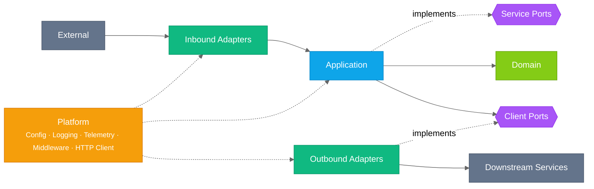
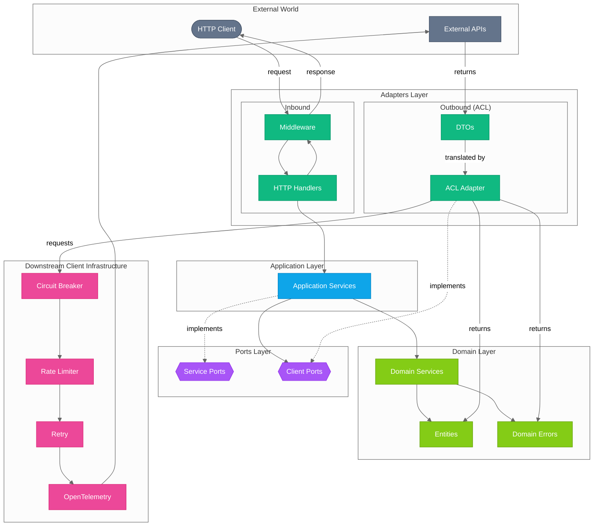
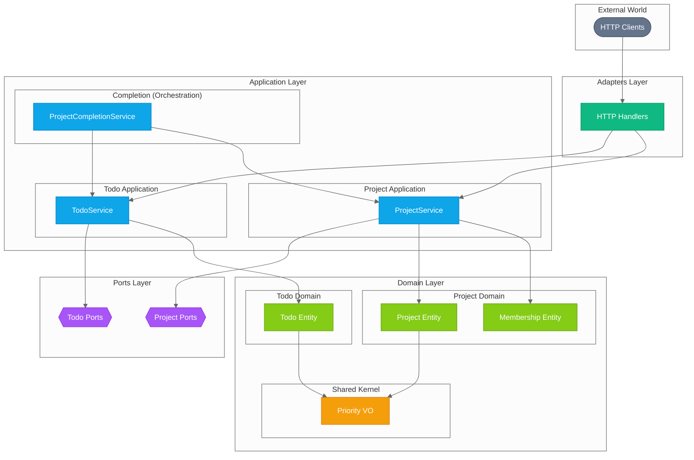
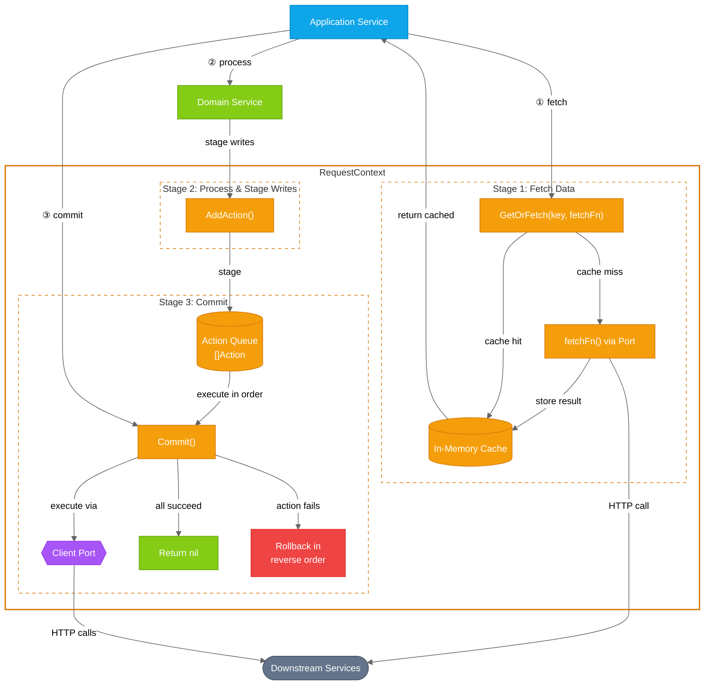
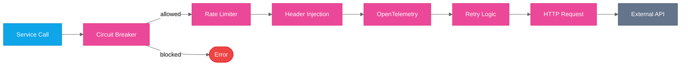
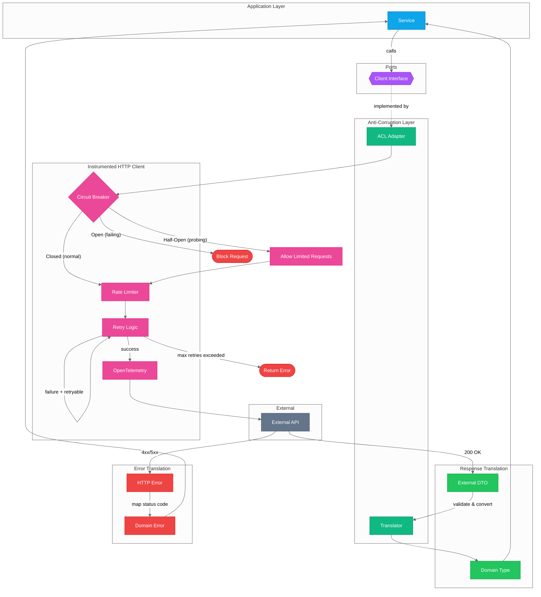

# Architecture

This document describes the architecture of the Go Service Template, which implements Clean/Hexagonal Architecture.

## Table of Contents

- [Architecture](#architecture)
  - [Introduction](#introduction)
  - [Architecture Overview](#architecture-overview)
    - [High-Level Layer Structure](#high-level-layer-structure)
    - [Detailed Component Architecture](#detailed-component-architecture)
    - [Layer Descriptions](#layer-descriptions)
    - [Scaling to Multiple Domains](#scaling-to-multiple-domains)
    - [Domain-Driven Design Concepts](#domain-driven-design-concepts)
    - [Domain Extensibility Patterns](#domain-extensibility-patterns)
    - [Context](#context)
    - [Request Context Pattern](#request-context-pattern)
  - [Middleware Pipeline](#middleware-pipeline)
  - [Downstream Client Infrastructure](#downstream-client-infrastructure)
  - [Observability](#observability)
  - [Dependency Injection](#dependency-injection)
  - [Key Design Decisions](#key-design-decisions)
  - [References](#references)

---

## Introduction

This service template implements **Hexagonal Architecture** (also known as Ports and Adapters), a pattern that
isolates the core business logic from external concerns. The key benefits are:

- **Testability**: Core logic can be tested without infrastructure dependencies
- **Flexibility**: Swap implementations (databases, APIs) without changing business logic. Safely evolve data
  entities and structures with changes isolated to specific layers.
- **Maintainability**: Clear boundaries prevent coupling between layers

---

## Architecture Overview

### High-Level Layer Structure

The architecture is organized into distinct layers, with dependencies flowing inward toward the domain:



**Legend:**

| Element                                                         | Meaning                      |
| --------------------------------------------------------------- | ---------------------------- |
|  Lime   | Domain                       |
|  Purple | Ports (interfaces)           |
|  Blue   | Application                  |
|  Teal   | Adapters                     |
|  Gray   | External                     |
|  Amber  | Platform                     |
| Hexagon (`{{...}}`)                                             | Port / interface boundary    |
| Stadium (`([...])`)                                             | System boundary (entry/exit) |
| Solid arrow (`-->`)                                             | Data / request flow          |
| Dashed arrow (`-.->`)                                           | Dependency or implements     |

### Detailed Component Architecture

This diagram shows how components within each layer connect:



**Legend:**

| Element                                                         | Meaning                                       |
| --------------------------------------------------------------- | --------------------------------------------- |
|  Lime   | Domain                                        |
|  Purple | Ports (interfaces)                            |
|  Blue   | Application                                   |
|  Teal   | Adapters                                      |
|  Pink   | Infrastructure (HTTP client, circuit breaker) |
|  Gray   | External                                      |
| Stadium (`([...])`)                                             | System boundary (entry/exit)                  |
| Solid arrow (`-->`)                                             | Data / request flow                           |
| Dashed arrow (`-.->`)                                           | Dependency or implements                      |

### Layer Descriptions

#### Domain Layer (`/internal/domain/`)

The **innermost layer** containing pure business logic with no external dependencies.

| Component           | Purpose                                                                      |
| ------------------- | ---------------------------------------------------------------------------- |
| **Domain Services** | Pure business logic that doesn't fit in a single entity (no I/O, no logging) |
| **Entities**        | Business objects with behavior and rules                                     |
| **Domain Errors**   | Business-meaningful error types (`NotFoundError`, `ValidationError`, etc.)   |

**Key Characteristic:** Domain services and entities have **zero infrastructure dependencies**. They are pure
functions/methods that can be tested without mocks.

**Domain Error Hierarchy:**

```go
// Sentinel errors for errors.Is() checking
var ErrNotFound = errors.New("not found")
var ErrValidation = errors.New("validation error")
var ErrConflict = errors.New("conflict")
var ErrForbidden = errors.New("forbidden")
var ErrUnavailable = errors.New("unavailable")
```

#### Ports Layer (`/internal/ports/`)

**Interfaces** that define contracts between layers. Ports are the API that the application exposes to adapters.

| File          | Purpose                                                     |
| ------------- | ----------------------------------------------------------- |
| `services.go` | Service port interfaces (implemented by application layer)  |
| `clients.go`  | Client port interfaces (implemented by outbound adapters)   |
| `health.go`   | Health check interfaces (`HealthChecker`, `HealthRegistry`) |

#### Application Layer (`/internal/app/`)

**Use case orchestration**. Application services coordinate between domain logic and infrastructure but contain
**no business logic themselves**.

**Responsibilities:**

1. **Receive requests** via service port (called by inbound adapters/handlers)
2. **Fetch data** by calling client ports (which resolve to ACL adapters → downstream APIs → domain entities)
3. **Process data** by passing domain entities to domain services for business logic
4. **Commit results** (persist via client ports, return responses, publish events)
5. **Handle cross-cutting concerns** (logging, tracing, error wrapping)

**What does NOT belong here:**

- HTTP/gRPC specifics
- Database queries
- **Business logic** (belongs in domain services/entities)

#### Adapters Layer (`/internal/adapters/`)

**Concrete implementations** of ports. Adapters translate between external formats and domain types.

**Inbound Adapters** (handle incoming requests):

| Directory          | Purpose                                   |
| ------------------ | ----------------------------------------- |
| `http/`            | HTTP server, router, handlers, middleware |
| `http/handlers/`   | Request handlers (controllers)            |
| `http/middleware/` | Cross-cutting HTTP concerns               |
| `http/dto/`        | HTTP DTOs and error responses             |

**Outbound Adapters / Anti-Corruption Layer (ACL)** (call external services):

| Directory      | Purpose                                                                                        |
| -------------- | ---------------------------------------------------------------------------------------------- |
| `clients/`     | External service clients with retry and circuit breaker                                        |
| `clients/acl/` | ACL adapters that translate external DTOs to domain types and external errors to domain errors |

The **Anti-Corruption Layer** protects the domain from external service representations by:

- Keeping external DTOs private (unexported)
- Translating external data to domain entities
- Mapping HTTP errors to domain errors
- Isolating the domain from external API changes

**ACL File Convention**: Prefix all ACL files with the domain name so multiple downstream
integrations coexist cleanly in the same `acl/` directory:

| File                 | Purpose                            |
| -------------------- | ---------------------------------- |
| `todo_client.go`     | External client adapter            |
| `todo_translator.go` | DTO → Domain entity translation    |
| `todo_errors.go`     | HTTP status → Domain error mapping |

#### Platform Layer (`/internal/platform/`)

**Infrastructure cross-cutting concerns** used by all layers.

| Directory     | Purpose                                           |
| ------------- | ------------------------------------------------- |
| `config/`     | Configuration loading and validation              |
| `health/`     | Thread-safe health check registry                 |
| `httpclient/` | Instrumented HTTP client (circuit breaker, retry) |
| `logging/`    | Structured logging setup                          |
| `telemetry/`  | OpenTelemetry tracing and metrics                 |

### Scaling to Multiple Domains

This section extends the [single-domain directory structure defined in ADR-0001](./adr/0001-hexagonal-architecture.md#directory-mapping-single-domain-starting-point).
As services grow, they often need to manage multiple bounded contexts or sub-domains. This
section describes how to organize multiple domains within the hexagonal architecture while
maintaining clear boundaries.

#### When to Introduce Multiple Domains

Consider splitting into multiple domains when:

- **Distinct business concepts**: The service handles clearly separate business areas
  (e.g., Todos and Projects)
- **Different rates of change**: Some areas evolve frequently while others are stable
- **Team boundaries**: Different teams own different areas of functionality
- **Complex entity relationships**: Entities become heavily interconnected

> **Warning**: Don't prematurely split. Start with a single domain and extract when
> complexity demands it.

#### Directory Structure

Organize by domain first, then by layer within each domain:

```text
internal/
├── domain/
│   ├── todo/               # Todo bounded context
│   │   ├── todo.go         # Todo entity
│   │   ├── category.go     # Category value object
│   │   └── errors.go       # Todo-specific errors
│   ├── project/            # Project bounded context
│   │   ├── project.go
│   │   ├── membership.go
│   │   └── errors.go
│   └── shared/             # Shared domain concepts
│       └── priority.go     # Value objects used across domains
├── ports/
│   ├── todo/               # Todo service/client ports
│   │   └── services.go
│   ├── project/            # Project service/client ports
│   │   └── services.go
│   └── health.go           # Cross-cutting ports
├── app/
│   ├── todo/               # Todo application services
│   │   └── todo_service.go
│   └── project/            # Project application services
│       └── project_service.go
├── adapters/
│   ├── http/
│   │   ├── handlers/
│   │   │   ├── todo/       # Todo HTTP handlers
│   │   │   └── project/    # Project HTTP handlers
│   │   └── dto/
│   │       ├── todo/       # Todo DTOs
│   │       └── project/    # Project DTOs
│   └── clients/acl/
│       ├── todo/           # Todo external client adapters
│       └── project/        # Project external client adapters
└── platform/               # Remains flat (cross-cutting)
```

#### Cross-Domain Communication

Domains should communicate through well-defined interfaces, not by directly accessing each
other's internals.

##### Pattern 1: Application Service Orchestration

The application layer coordinates between domains:

```go
// app/project/project_completion_service.go
type ProjectCompletionService struct {
    todoService    *todo.TodoService
    projectService *project.ProjectService
    logger         *slog.Logger
}

func (s *ProjectCompletionService) CompleteProject(ctx context.Context, projectID string) error {
    // Get all todos for this project
    todos, err := s.todoService.ListByProject(ctx, projectID)
    if err != nil {
        return err
    }

    // Verify all todos are done
    for _, t := range todos {
        if t.Status != domain.StatusDone {
            return fmt.Errorf("todo %d not complete", t.ID)
        }
    }

    // Mark project as completed
    return s.projectService.MarkCompleted(ctx, projectID)
}
```

**When to use**: For synchronous operations where the orchestrating service needs to
coordinate multiple domains in a transaction-like manner.

##### Pattern 2: Domain Events

Domains publish events that other domains subscribe to:

```go
// domain/todo/events.go
type TodoCompletedEvent struct {
    TodoID    int64
    ProjectID string
    DoneAt    time.Time
}

func (e TodoCompletedEvent) EventType() string { return "todo.completed" }

// app/project/project_service.go
func (s *ProjectService) HandleTodoCompleted(
    ctx context.Context,
    event todo.TodoCompletedEvent,
) error {
    return s.UpdateProgress(ctx, event.ProjectID)
}
```

**When to use**: For asynchronous, loosely-coupled communication. Enables eventual
consistency and better fault isolation.

#### Shared Kernel Pattern

When domains need common types (value objects, shared identifiers), place them in
`domain/shared/`. Keep the shared kernel minimal:

- Only value objects and simple types
- No entities or services
- Changes require agreement from all consuming domains

#### Domain Boundary Visualization



**Legend:**

| Element                                                         | Meaning                      |
| --------------------------------------------------------------- | ---------------------------- |
|  Lime   | Domain                       |
|  Purple | Ports (interfaces)           |
|  Blue   | Application                  |
|  Teal   | Adapters                     |
|  Gray   | External                     |
|  Amber  | Shared kernel                |
| Hexagon (`{{...}}`)                                             | Port / interface boundary    |
| Stadium (`([...])`)                                             | System boundary (entry/exit) |

#### Migration Path

To migrate from single domain to multiple domains:

1. **Identify boundaries**: Map entities and use cases to potential domains
2. **Extract domain layer first**: Create subdirectories, move entities
3. **Extract ports**: Create domain-specific port files
4. **Extract application services**: One service per domain
5. **Update adapters**: Organize handlers and DTOs by domain
6. **Add cross-domain communication**: Introduce orchestration or events as needed

See [ADR-0001](./adr/0001-hexagonal-architecture.md) for the foundational architecture
decision.

### Domain-Driven Design Concepts

This section describes how DDD tactical patterns are applied in this service template.

#### Use Cases vs Domain Services

The template distinguishes between two types of services:

| Aspect           | Application Service (Use Case)  | Domain Service                   |
| ---------------- | ------------------------------- | -------------------------------- |
| **Location**     | `/internal/app/`                | `/internal/domain/`              |
| **Purpose**      | Orchestrates workflows          | Encapsulates pure business logic |
| **Dependencies** | Ports, domain services, logging | None (pure functions)            |
| **I/O**          | Yes (via ports)                 | Never                            |
| **Example**      | `ProjectService.GetProject()`   | `Todo.Validate()`                |

**Application Services (Use Cases):**

Application services coordinate multiple domain operations, call external services through ports,
handle logging/tracing, and manage transactions.

```go
// internal/app/project_service.go - Application Service
func (s *ProjectService) GetProject(ctx context.Context, id int64) (*domain.Project, error) {
    s.logger.InfoContext(ctx, "fetching project", slog.Int64("id", id))

    // Orchestrates: calls port, handles errors, logs
    project, err := s.todoClient.GetProject(ctx, id)
    if err != nil {
        s.logger.ErrorContext(ctx, "failed to fetch project",
            slog.Int64("id", id), slog.Any("error", err))
        return nil, err
    }

    return project, nil
}
```

**Domain Services:**

Domain services contain pure business logic with no infrastructure dependencies.
They can be tested without mocks and belong in `/internal/domain/` alongside entities.

```go
// internal/domain/todo/progress.go - Domain Service (Pure Logic)
func CalculateProjectProgress(todos []Todo) int {
    // Pure business rule - no I/O, no logging
    if len(todos) == 0 {
        return 0
    }
    var total int
    for i := range todos {
        total += todos[i].ProgressPercent
    }
    return total / len(todos)
}
```

#### Placing Logic: Domain vs Application Layer

The distinction between "orchestration" and "business logic" can be subtle. Use this guide
when you're unsure where code belongs.

**Decision Heuristic:**

1. Does this logic require I/O (database, API call, external service)? → **Application Layer**
2. Is it a pure business rule or calculation with no dependencies? → **Domain Layer**
3. Does it coordinate multiple domain operations via ports? → **Application Layer**

**Common Gray Areas:**

| Scenario                                                     | Layer                                                     | Reasoning                                                                           |
| ------------------------------------------------------------ | --------------------------------------------------------- | ----------------------------------------------------------------------------------- |
| Validation needing a DB lookup (e.g. "email must be unique") | Application                                               | Requires I/O via port; domain defines `ErrConflict`, app detects the condition      |
| Multi-entity business rule (e.g. "project can hold N todos") | Domain for the rule, application layer for fetching       | `project.CanAddTodo(count)` is a domain method; application layer fetches the count |
| Business calculation with logging                            | Domain for the calc, application layer wraps with logging | `CalculateProgress(todos)` is pure; application layer logs before/after             |
| Entity state transitions (e.g. "mark todo complete")         | Domain (entity method)                                    | Valid transitions are a business rule                                               |
| Coordinated state changes across entities                    | Application                                               | Orchestrates multiple port calls                                                    |

#### Example: Validation with External Dependency

```go
// ❌ WRONG - Domain layer calling infrastructure
// internal/domain/project.go
func (p *Project) ValidateUnique(ctx context.Context, repo ProjectRepository) error {
    existing, _ := repo.GetByName(ctx, p.Name) // Domain depends on I/O!
    if existing != nil {
        return ErrConflict
    }
    return nil
}

// ✅ RIGHT - Application layer orchestrates, domain defines rules and errors
// internal/app/project_service.go
func (s *ProjectService) CreateProject(ctx context.Context, project *domain.Project) (*domain.Project, error) {
    if err := project.Validate(); err != nil { // Domain: pure validation
        return nil, err
    }

    existing, err := s.todoClient.GetByName(ctx, project.Name) // App: I/O via port
    if err != nil && !errors.Is(err, domain.ErrNotFound) {
        return nil, err
    }
    if existing != nil {
        return nil, domain.ErrConflict // Domain: defines the error type
    }

    return s.todoClient.CreateProject(ctx, project)
}
```

#### Example: Multi-Entity Business Rule

```go
// ❌ WRONG - Business rule lives in the application layer
// internal/app/project_service.go
func (s *ProjectService) AddTodo(ctx context.Context, projectID int64, td *todo.Todo) (*todo.Todo, error) {
    project, _ := s.todoClient.GetProject(ctx, projectID)
    todos, _ := s.todoClient.GetProjectTodos(ctx, projectID, todo.Filter{})

    if len(todos) >= project.MaxTodos { // Business rule in application layer!
        return nil, domain.ErrValidation
    }

    return s.todoClient.CreateTodo(ctx, td)
}

// ✅ RIGHT - Domain owns the rule, application layer orchestrates data fetching
// internal/domain/project/project.go
func (p *Project) CanAddTodo(currentCount int) error {
    if currentCount >= p.MaxTodos {
        return fmt.Errorf("project at capacity (%d/%d): %w", currentCount, p.MaxTodos, domain.ErrValidation)
    }
    return nil
}

// internal/app/project_service.go
func (s *ProjectService) AddTodo(ctx context.Context, projectID int64, td *todo.Todo) (*todo.Todo, error) {
    proj, err := s.todoClient.GetProject(ctx, projectID)
    if err != nil {
        return nil, err
    }

    todos, err := s.todoClient.GetProjectTodos(ctx, projectID, todo.Filter{})
    if err != nil {
        return nil, err
    }

    if err := proj.CanAddTodo(len(todos)); err != nil { // Domain rule
        return nil, err
    }

    return s.todoClient.CreateTodo(ctx, td)
}
```

**Anti-Patterns to Avoid:**

| Anti-Pattern                                      | Why It's Wrong                                 | Fix                                                  |
| ------------------------------------------------- | ---------------------------------------------- | ---------------------------------------------------- |
| Domain service calls a port                       | Domain depends on infrastructure               | Move to application layer                            |
| Application layer contains inline business rules  | Logic coupled to orchestration, harder to test | Extract to domain entity method or domain service    |
| Entity method accepts a logger                    | Domain polluted with infrastructure            | Log in application layer before/after calling domain |
| Application layer re-implements entity validation | Validation logic drifts, tested in two places  | Call the entity's `Validate()` method instead        |

#### Orchestration Patterns

Application services coordinate multiple operations using two patterns:

**Sequential Orchestration:**

Simple, synchronous execution where each step must complete before the next:

```go
func (s *ProjectService) AddTodo(ctx context.Context, projectID int64, td *todo.Todo) (*todo.Todo, error) {
    // Step 1: Validate
    if err := td.Validate(); err != nil {
        return nil, err
    }

    // Step 2: Verify project exists
    _, err := s.todoClient.GetProject(ctx, projectID)
    if err != nil {
        return nil, fmt.Errorf("verifying project: %w", err)
    }

    // Step 3: Create todo in project
    td.ProjectID = &projectID
    created, err := s.todoClient.CreateTodo(ctx, td)
    if err != nil {
        return nil, fmt.Errorf("creating todo: %w", err)
    }

    return created, nil
}
```

**Parallel Orchestration:**

For independent operations that can run concurrently:

```go
func (s *DashboardService) GetDashboard(ctx context.Context, projectID string) (*Dashboard, error) {
    var (
        wg      sync.WaitGroup
        todoErr error
        projErr error
        todos   []*Todo
        project *Project
    )

    wg.Add(2)

    go func() {
        defer wg.Done()
        project, projErr = s.projectClient.GetByID(ctx, projectID)
    }()

    go func() {
        defer wg.Done()
        todos, todoErr = s.todoClient.ListByProject(ctx, projectID)
    }()

    wg.Wait()

    if projErr != nil {
        return nil, fmt.Errorf("fetching project: %w", projErr)
    }
    if todoErr != nil {
        return nil, fmt.Errorf("fetching todos: %w", todoErr)
    }

    return &Dashboard{Project: project, Todos: todos}, nil
}
```

**Concurrent Fan-Out with Partial Success:**

For bulk operations where each item should succeed or fail independently, use the
`fanout.Run` helper (`internal/app/fanout/`). This provides bounded concurrency, ordered
results, and context-aware cancellation. It differs from ActionGroup (all-or-nothing
rollback) -- here, individual failures are collected and reported per item:

```go
const maxConcurrentUpdates = 5

func (s *ProjectService) BulkUpdateTodos(ctx context.Context, projectID int64, updates []ports.TodoUpdate) (*ports.BulkUpdateResult, error) {
    // 1. Validate inputs and verify ownership (fail fast on hard errors)
    // ...

    // 2. Fan out individual API calls with bounded concurrency
    results := fanout.Run(ctx, maxConcurrentUpdates, updates,
        func(ctx context.Context, u ports.TodoUpdate) (*todo.Todo, error) {
            return s.todoClient.UpdateTodo(ctx, u.TodoID, u.Todo)
        },
    )

    // 3. Collect per-item outcomes (results are in input order)
    result := &ports.BulkUpdateResult{}
    for i, r := range results {
        if r.Err != nil {
            result.Errors = append(result.Errors, ports.BulkUpdateError{TodoID: updates[i].TodoID, Err: r.Err})
        } else {
            result.Updated = append(result.Updated, *r.Value)
        }
    }
    return result, nil
}
```

`fanout.Run[T, R]` is generic, bounded, and context-aware — see
[ADR-0002](adr/0002-thread-safety.md) for the full design. The HTTP client's rate limiter
throttles concurrent outbound calls automatically. The handler always returns HTTP 200 for
valid requests; per-item failures appear in the response body.

**When to use each pattern:**

| Pattern                      | Semantics       | Use When                                        |
| ---------------------------- | --------------- | ----------------------------------------------- |
| **ActionGroup + Commit**     | All-or-nothing  | Items must all succeed or all roll back         |
| **Concurrent fan-out**       | Partial success | Items are independent; report per-item outcomes |
| **Sequential orchestration** | Step-by-step    | Steps depend on prior results                   |

#### Aggregate Boundaries for API Call Grouping

When orchestrating multiple API calls, group related data fetches considering:

1. **Consistency Requirements**: Data that must be consistent should be fetched together
2. **Failure Isolation**: Independent data can fail independently
3. **Caching Strategy**: Use Request Context memoization for reused data

##### Example: Project Detail Aggregate

```go
// Project aggregate: project + todos
// These are always needed together and must be consistent
func (s *ProjectService) GetProject(ctx context.Context, id int64) (*domain.Project, error) {
    rc := appctx.New(ctx)

    // Fetch project (cached for subsequent use)
    project, err := rc.GetOrFetch("project:"+fmt.Sprint(id), s.fetchProject(id))
    if err != nil {
        return nil, err
    }

    // Fetch related todos
    todos, err := rc.GetOrFetch("todos:project:"+fmt.Sprint(id), s.fetchProjectTodos(id))
    if err != nil {
        return nil, err
    }

    p := proj.(*project.Project)
    p.Todos = todos.([]todo.Todo)
    return p, nil
}
```

### Domain Extensibility Patterns

This section describes patterns for extending the domain as the service grows.

#### Multiple Bounded Contexts

When a service evolves to handle multiple related domains, organize code by bounded context:

```text
internal/
├── domain/
│   ├── todos/            # Todos bounded context
│   │   ├── todo.go
│   │   ├── category.go
│   │   └── errors.go
│   ├── projects/         # Projects bounded context
│   │   ├── project.go
│   │   ├── membership.go
│   │   └── errors.go
│   └── shared/           # Shared kernel
│       └── money.go
├── ports/
│   ├── todos/
│   │   ├── services.go
│   │   └── clients.go
│   └── projects/
│       ├── services.go
│       └── clients.go
└── app/
    ├── todos/
    │   └── todo_service.go
    └── projects/
        └── project_service.go
```

**Guidelines:**

- Each bounded context has its own package
- Shared kernel contains only value objects used across contexts
- Contexts communicate through application layer, not directly

#### Plugin/Strategy Patterns with Interfaces

For behavior that varies at runtime, use interfaces:

##### Strategy Pattern Example: TODO Category Processing

When different categories of items require different processing behavior (e.g., work TODOs vs
personal TODOs), use the Strategy pattern to vary behavior without splitting into separate
bounded contexts:

```go
// app/processors/processor.go
type TodoProcessor interface {
    Process(ctx context.Context, td *todo.Todo) error
    Category() todo.Category
}

// app/processors/work.go
type WorkProcessor struct { /* project tracking, sprint integration */ }
func (p *WorkProcessor) Process(ctx context.Context, td *todo.Todo) error { ... }
func (p *WorkProcessor) Category() todo.Category { return todo.CategoryWork }

// app/processors/personal.go
type PersonalProcessor struct { /* reminders, recurring schedules */ }
func (p *PersonalProcessor) Process(ctx context.Context, td *todo.Todo) error { ... }
func (p *PersonalProcessor) Category() todo.Category { return todo.CategoryPersonal }
```

The application service selects the appropriate processor:

```go
// app/project_service.go
type ProjectService struct {
    processors map[todo.Category]processors.TodoProcessor
    // ...
}

func (s *ProjectService) ProcessTodo(ctx context.Context, td *todo.Todo) error {
    proc, ok := s.processors[td.Category]
    if !ok {
        return domain.ErrValidation
    }
    return proc.Process(ctx, td)
}
```

> **When to extract to sub-domains**: If work and personal TODOs eventually require different
> entities, different downstream APIs, or different team ownership, follow the migration path
> in [Scaling to Multiple Domains](#scaling-to-multiple-domains).

##### Plugin Pattern Example: Feature Flags

```go
// ports/featureflags.go - Already exists in this template
type FeatureFlags interface {
    IsEnabled(ctx context.Context, flag string, defaultValue bool) bool
    GetString(ctx context.Context, flag string, defaultValue string) string
    GetInt(ctx context.Context, flag string, defaultValue int) int
    GetFloat(ctx context.Context, flag string, defaultValue float64) float64
    GetJSON(ctx context.Context, flag string, target any) error
}
```

Implementations can be swapped at runtime:

- `launchdarkly.Client` - LaunchDarkly SDK
- `unleash.Client` - Unleash SDK
- `config.StaticFlags` - Config-file based (for testing)
- `memory.MockFlags` - In-memory (for unit tests)

##### Registering Implementations

With `samber/do`, select the implementation at runtime inside a provider function:

```go
// main.go - Register feature flags provider
do.Provide(injector, func(i do.Injector) (ports.FeatureFlags, error) {
    cfg := do.MustInvoke[*config.Config](i)

    switch cfg.FeatureFlags.Provider {
    case "launchdarkly":
        return launchdarkly.New(cfg.FeatureFlags.SDKKey), nil
    case "unleash":
        return unleash.New(cfg.FeatureFlags.URL), nil
    default:
        return config.NewStaticFlags(cfg.FeatureFlags.Static), nil
    }
})
```

### Context

Go's `context.Context` is a fundamental pattern used throughout this codebase. It carries request-scoped data,
deadlines, and cancellation signals across API boundaries.

**What Context Carries:**

| Data                    | Purpose                                                           |
| ----------------------- | ----------------------------------------------------------------- |
| **Request ID**          | Unique identifier for this specific request                       |
| **Correlation ID**      | Identifier that tracks a business transaction across services     |
| **RequestContext**      | Request-scoped memoization cache and staged action queue (appctx) |
| **Deadline/Timeout**    | When the request should be cancelled                              |
| **Cancellation Signal** | Notifies when the client disconnects or request is cancelled      |
| **Logger**              | Request-enriched structured logger                                |
| **Trace Span**          | OpenTelemetry span for distributed tracing                        |

**Extracting Values from Context:**

```go
// Extract request ID
requestID := middleware.RequestIDFromContext(ctx)

// Extract correlation ID
correlationID := middleware.CorrelationIDFromContext(ctx)

// Extract RequestContext for memoized fetching (nil without middleware)
rc := appctx.FromContext(ctx)

// Get context-aware logger (includes request ID, correlation ID)
logger := logging.FromContext(ctx)
logger.Info("processing request", slog.String("user_id", userID))

// Check if context is cancelled
select {
case <-ctx.Done():
    return ctx.Err() // context.Canceled or context.DeadlineExceeded
default:
    // Continue processing
}
```

**Best Practices:**

1. **Always pass context as first parameter**: `func DoSomething(ctx context.Context, ...)`
2. **Don't store context in structs**: Pass it through function calls
3. **Respect cancellation**: Check `ctx.Done()` in long-running operations
4. **Use context-aware logger**: `logging.FromContext(ctx)` includes request metadata

### Request Context Pattern

For orchestration services that coordinate multiple downstream calls, the Request Context
Pattern provides request-scoped data fetching, staged writes, and atomic commit with rollback.

> **Important**: `RequestContext` is an application-layer wrapper that **embeds** Go's standard
> `context.Context`. It does not replace `context.Context` -- it extends it for orchestration
> use cases. Simple CRUD operations should use `context.Context` directly.

**Location:** `/internal/app/context/`

See [ADR-0001](./adr/0001-hexagonal-architecture.md#request-context-pattern-for-orchestration) for the architectural decision.

| Component              | Purpose                                                          |
| ---------------------- | ---------------------------------------------------------------- |
| `RequestContext`       | Main struct with thread-safe cache and action queue              |
| `GetOrFetch[T]()`      | Lazy memoization — returns a copy of the cached entity           |
| `GetRef[T]()`          | Shared mutable access — returns `*SafeRef[T]` for concurrent use |
| `Put[T]()`             | Write-through cache update — visible to all goroutines           |
| `Invalidate()`         | Remove cached entry, forcing re-fetch on next access             |
| `SafeRef[T]`           | Per-entity thread-safe wrapper with `Get`, `Set`, `Update`       |
| `AddAction()`          | Stage write operations for later execution                       |
| `Commit()`             | Execute all actions with automatic rollback                      |
| `DataProvider`         | Interface for type-safe data fetching (see below)                |
| `Action`               | Interface for staged write operations (see below)                |
| `FromContext()`        | Extract RequestContext from `context.Context` (nil if absent)    |
| `WithRequestContext()` | Store RequestContext in `context.Context`                        |

All cache and queue operations are **thread-safe** — see [ADR-0002](adr/0002-thread-safety.md)
for the full concurrency design including lock hierarchy and per-method analysis.

#### Middleware Injection

The `AppContext` middleware (see [Middleware Pipeline](#middleware-pipeline)) creates a
`RequestContext` per HTTP request and stores it in Go's `context.Context`. Application
services retrieve it via `appctx.FromContext(ctx)`:

```go
func (s *ProjectService) fetchProject(ctx context.Context, id int64) (*project.Project, error) {
    if rc := appctx.FromContext(ctx); rc != nil {
        return appctx.GetOrFetch(rc, projectCacheKey(id), func(ctx context.Context) (*project.Project, error) {
            return s.todoClient.GetProject(ctx, id)
        })
    }
    return s.todoClient.GetProject(ctx, id) // fallback without middleware
}
```

The nil-check fallback ensures unit tests work without the middleware -- simply pass
`context.Background()` and the service falls back to direct client calls.



**Legend:**

| Element                                                         | Meaning                          |
| --------------------------------------------------------------- | -------------------------------- |
|  Blue   | Application service              |
|  Lime   | Domain service / success path    |
|  Purple | Port (interface)                 |
|  Amber  | RequestContext operations        |
|  Gray   | Downstream services              |
|  Red    | Rollback / error path            |
| Hexagon (`{{...}}`)                                             | Port / interface boundary        |
| Circle (`((...))`)                                              | In-memory storage (cache, queue) |
| Stadium (`([...])`)                                             | External I/O boundary            |
| Dashed border                                                   | Stage boundary                   |

**`DataProvider` Interface:**

```go
// DataProvider wraps GetOrFetch with type safety for a specific data type.
type DataProvider[T any] struct {
    key     string
    fetchFn func(ctx context.Context) (T, error)
}

func (p *DataProvider[T]) Get(rc *RequestContext) (T, error) {
    return GetOrFetch[T](rc, p.key, p.fetchFn)
}
```

**`Action` Interface:**

```go
type Action interface {
    Execute(ctx context.Context) error
    Rollback(ctx context.Context) error
    Description() string
}
```

**Action Storage and Execution Model:**

Actions are stored as an **in-memory ordered slice** (`[]Action`) within the `RequestContext`
struct. They are NOT persisted -- they exist only for the lifetime of the HTTP request.

- **Sequential execution (default)**: `Commit()` executes actions in insertion order. If
  action N fails, actions 0 through N-1 are rolled back in reverse order.
- **Parallel execution (opt-in)**: Use `ActionGroup` to run independent actions concurrently.
  Groups execute sequentially relative to each other:

```go
// Actions within a group execute in parallel.
// Groups execute sequentially.
rc.AddGroup(
    &ValidateTodoAction{...},
    &CheckProjectCapacityAction{...},
)
rc.AddAction(&CreateTodoAction{...})  // Runs after group completes
rc.AddGroup(
    &UpdateProjectProgressAction{...},
    &SendNotificationAction{...},
)
```

- **Parallel rollback**: If any action in a group fails, in-progress actions are cancelled
  via context cancellation, then all completed actions roll back in reverse group order.

#### Thread Safety

All `RequestContext` operations are thread-safe for concurrent use from multiple goroutines.
The cache and action queue use independent mutexes, so they do not constrain each other.

**For simple reads** (get a copy of a cached entity):

```go
// GetOrFetch returns a copy — safe for the calling goroutine to use.
todo, err := appctx.GetOrFetch(rc, "todo:123", fetchTodo)
```

**For shared mutable access** (multiple goroutines read/write the same entity):

```go
// GetRef returns a *SafeRef[T] — all callers get the same reference.
ref, err := appctx.GetRef(rc, "todo:123", fetchTodo)

// Goroutine A: read
current := ref.Get()  // returns a copy under read lock

// Goroutine B: write (immediately visible to all holders)
ref.Update(func(t *todo.Todo) { t.Status = todo.StatusComplete })

// Goroutine C: write-through cache update
appctx.Put(rc, "todo:123", updatedTodo)
```

**Key design properties:**

- No lock is ever held during I/O (fetches happen before cache lock is acquired)
- Cache works before, during, and after `Commit()` (independent of queue lifecycle)
- Per-entity `SafeRef` mutexes mean different entities don't contend with each other

See [ADR-0002](adr/0002-thread-safety.md) for the complete concurrency design: lock
hierarchy, per-method lock analysis, memory layout, and sequence diagrams.

#### Example: Todo Completion Saga

This example shows all three stages working together -- fetch with memoization, stage
writes, then commit with automatic rollback on failure:

```go
func (s *CompletionService) CompleteTodoWithEffects(ctx context.Context, todoID int64) error {
    rc := appctx.New(ctx)

    // Stage 1: Fetch data with memoization
    todo, err := rc.GetOrFetch("todo:"+fmt.Sprint(todoID), func(ctx context.Context) (any, error) {
        return s.todoClient.GetByID(ctx, todoID)
    })
    if err != nil {
        return err
    }

    // Stage 2: Process data - stage compensating actions
    _ = rc.AddAction(&MarkTodoDoneAction{TodoID: todoID})
    _ = rc.AddAction(&UpdateProjectProgressAction{ProjectID: todo.(*Todo).ProjectID})
    _ = rc.AddAction(&SendCompletionNotificationAction{TodoID: todoID})

    // Stage 3: Commit - execute all or rollback on failure
    return rc.Commit(ctx)
}
```

On failure, `Commit()` automatically rolls back executed actions in reverse order:


**When to use:**

- Orchestrating multiple downstream service calls where data is reused
- Coordinating writes that should succeed or fail together
- Complex use cases requiring rollback on failure

**When NOT to use:**

- Simple CRUD operations
- Single-service calls
- Operations where database transactions suffice

---

## Middleware Pipeline

### Inbound Middleware (HTTP Server)

HTTP requests flow through a middleware chain before reaching handlers. Each middleware adds specific functionality.

```mermaid
%%{init: {'theme': 'neutral', 'themeVariables': { 'fontSize': '14px' }}}%%
flowchart LR
    subgraph Request["Request Path"]
        direction LR
        REQ(["HTTP Request"])
        M1["Recovery"]
        M2["RequestID"]
        M3["CorrelationID"]
        M4["AppContext"]
        M5["OpenTelemetry"]
        M6["Logging"]
        M7["Timeout"]
        H["Handler"]
    end

    subgraph Response["Response Path"]
        direction RL
        RES(["HTTP Response"])
        R1["Recovery"]
        R5["OpenTelemetry"]
        R6["Logging"]
    end

    REQ --> M1 --> M2 --> M3 --> M4 --> M5 --> M6 --> M7 --> H
    H --> R6 --> R5 --> R1 --> RES

    classDef middleware fill:#10b981,stroke:#059669,color:#fff
    classDef handler fill:#0ea5e9,stroke:#0284c7,color:#fff
    classDef io fill:#64748b,stroke:#475569,color:#fff
    classDef responseMiddleware fill:#22c55e,stroke:#16a34a,color:#fff

    class M1,M2,M3,M4,M5,M6,M7 middleware
    class R1,R5,R6 responseMiddleware
    class H handler
    class REQ,RES io
```



**Legend:**

| Component           | Color Sample                                             | Hex Code  | Description                  |
| ------------------- | -------------------------------------------------------- | --------- | ---------------------------- |
| Request Middleware  |  | `#10b981` | Active during request phase  |
| Response Middleware |  | `#22c55e` | Active during response phase |
| Handler             |  | `#0ea5e9` | Business logic               |
| I/O                 |  | `#64748b` | Request/Response             |

**Note:** RequestID and CorrelationID middleware set response headers during the request phase and don't perform
additional processing on the response path.

**Middleware Responsibilities:**

| Order | Middleware        | Request Phase                           | Response Phase                       |
| ----- | ----------------- | --------------------------------------- | ------------------------------------ |
| 1     | **Recovery**      | Sets up panic handler                   | Catches panics, returns 500          |
| 2     | **RequestID**     | Generate/extract ID, set header         | -                                    |
| 3     | **CorrelationID** | Extract/propagate ID, set header        | -                                    |
| 4     | **AppContext**    | Create RequestContext, store in context | -                                    |
| 5     | **OpenTelemetry** | Start trace span                        | End span, record status              |
| 6     | **Logging**       | Log request start                       | Log request completion with duration |
| 7     | **Timeout**       | Set context deadline                    | Cancel if deadline exceeded          |

**Middleware Order Rationale:**

- Recovery must be first to catch panics from any subsequent middleware
- IDs must be generated before logging/tracing uses them
- AppContext runs after IDs are set so the embedded context carries request metadata,
  and before OpenTelemetry so the RequestContext is available during the traced lifecycle
- Timeout is last before handler to accurately measure business logic time

### Outbound Middleware (HTTP Client)

The instrumented HTTP client applies middleware-like processing to outbound requests:



**Legend:**

| Component                        | Color Sample                                             | Hex Code  |
| -------------------------------- | -------------------------------------------------------- | --------- |
| Application                      |  | `#0ea5e9` |
| Downstream Client Infrastructure |  | `#ec4899` |
| External                         |  | `#64748b` |
| Error                            |  | `#ef4444` |

**Outbound Processing Steps:**

| Order | Component            | Purpose                                                           |
| ----- | -------------------- | ----------------------------------------------------------------- |
| 1     | **Circuit Breaker**  | Block requests if downstream is unhealthy                         |
| 2     | **Rate Limiter**     | Throttle requests to prevent overwhelming downstream (per-client) |
| 3     | **Header Injection** | Add Request ID, Correlation ID, Auth headers                      |
| 4     | **OpenTelemetry**    | Create child span, propagate trace context                        |
| 5     | **Retry Logic**      | Retry on transient failures with backoff                          |
| 6     | **HTTP Request**     | Execute the actual HTTP call                                      |

---

## Downstream Client Infrastructure

Outbound HTTP calls use an instrumented client with circuit breaker protection and retry logic.



**Legend:**

| Component                        | Color Sample                                             | Hex Code  |
| -------------------------------- | -------------------------------------------------------- | --------- |
| Application                      |  | `#0ea5e9` |
| Ports (Interfaces)               |  | `#a855f7` |
| Adapters                         |  | `#10b981` |
| Downstream Client Infrastructure |  | `#ec4899` |
| External                         |  | `#64748b` |
| Error Path                       |  | `#ef4444` |
| Success Path                     |  | `#22c55e` |

### Circuit Breaker States

The circuit breaker protects downstream services by preventing requests when the service is unhealthy.

| State         | Behavior                                                                                                                                                                                        |
| ------------- | ----------------------------------------------------------------------------------------------------------------------------------------------------------------------------------------------- |
| **Closed**    | Normal operation. Requests flow through. Failures are counted.                                                                                                                                  |
| **Open**      | Failing state. Requests are immediately rejected to prevent cascade failures.                                                                                                                   |
| **Half-Open** | Recovery probing state. A limited number of requests are allowed through to test if the service has recovered. If these "probe" requests succeed, the circuit closes. If they fail, it reopens. |

**State Transitions:**

- `Closed → Open`: After `MaxFailures` consecutive failures
- `Open → Half-Open`: After `Timeout` duration passes (allows recovery probing)
- `Half-Open → Closed`: After `HalfOpenLimit` consecutive successes
- `Half-Open → Open`: On any failure during probing

### Retry with Exponential Backoff

When requests fail with retryable errors (network timeouts, 5xx responses), the client automatically retries
with increasing delays.

| Parameter         | Description                                            |
| ----------------- | ------------------------------------------------------ |
| `MaxAttempts`     | Maximum number of request attempts (including initial) |
| `InitialInterval` | Base delay before first retry (e.g., 100ms)            |
| `Multiplier`      | Factor to increase delay each attempt (e.g., 2.0)      |
| `MaxInterval`     | Maximum delay cap (e.g., 10s)                          |

**Backoff Formula:**

```text
delay = InitialInterval * Multiplier^attempt ± jitter
```

**What is Jitter?**

Jitter adds randomness (±25%) to the delay to prevent the **thundering herd problem**. Without jitter, if multiple
clients fail at the same time, they would all retry at exactly the same intervals, potentially overwhelming the
recovering service with synchronized retry waves.

**Example Calculation** (InitialInterval=100ms, Multiplier=2.0):

| Attempt | Base Delay | With Jitter (±25%) |
| ------- | ---------- | ------------------ |
| 1       | 100ms      | 75ms - 125ms       |
| 2       | 200ms      | 150ms - 250ms      |
| 3       | 400ms      | 300ms - 500ms      |
| 4       | 800ms      | 600ms - 1000ms     |

### Error Translation (ACL)

The Anti-Corruption Layer translates external representations to domain types:

| HTTP Status  | Domain Error     | When Used                            |
| ------------ | ---------------- | ------------------------------------ |
| 404          | `ErrNotFound`    | Resource doesn't exist               |
| 409          | `ErrConflict`    | Concurrent modification conflict     |
| 400, 422     | `ErrValidation`  | Invalid input data                   |
| 401, 403     | `ErrForbidden`   | Authentication/authorization failure |
| 5xx, Network | `ErrUnavailable` | Service temporarily unavailable      |

---

## Observability

This template integrates OpenTelemetry for comprehensive observability across three pillars: tracing, metrics, and logging.

### Distributed Tracing

Traces track requests as they flow through the system and across service boundaries.

| Component       | Tracing Behavior                        |
| --------------- | --------------------------------------- |
| HTTP Middleware | Creates root span for incoming requests |
| HTTP Client     | Creates child spans for outbound calls  |
| Circuit Breaker | Adds span events for state changes      |

**Trace Context Propagation:** The instrumented HTTP client automatically propagates trace context
(via W3C Trace Context headers) to downstream services.

### Metrics

Metrics are collected at key points to monitor system health and performance.

| Metric                         | Type      | Description              |
| ------------------------------ | --------- | ------------------------ |
| `http.server.request.duration` | Histogram | Incoming request latency |
| `http.server.request.total`    | Counter   | Total incoming requests  |
| `http.client.request.duration` | Histogram | Outbound request latency |
| `http.client.request.total`    | Counter   | Total outbound requests  |

**Labels/Attributes:**

- `http.method`: GET, POST, etc.
- `http.status_code`: Response status
- `peer.service`: Downstream service name
- `result`: success, error, circuit_open

### Structured Logging

All logs use structured JSON format with consistent fields:

```json
{
  "time": "2024-01-15T10:30:00Z",
  "level": "INFO",
  "msg": "request completed",
  "request_id": "abc-123",
  "correlation_id": "xyz-789",
  "duration_ms": 45,
  "status": 200
}
```

#### Secret Redaction

Sensitive data must never appear in logs, error messages, or API responses. Use Go's `slog.LogValuer`
interface to redact fields at the source:

**Pattern: `slog.LogValuer` on Domain Types**

Types that contain sensitive fields implement `LogValue()` to control their log representation:

```go
// internal/domain/api_credentials.go
type APICredentials struct {
    ClientID     string
    ClientSecret string
    Token        string
}

func (c APICredentials) LogValue() slog.Value {
    return slog.GroupValue(
        slog.String("client_id", c.ClientID),
        slog.String("client_secret", "[REDACTED]"),
        slog.String("token", "[REDACTED]"),
    )
}
```

Now `slog.Any("creds", creds)` automatically redacts -- no discipline required at log call sites.

#### Pattern: Redacting Middleware for HTTP Headers

Redact sensitive headers before they reach the structured logger:

```go
// internal/adapters/http/middleware/redact.go
var sensitiveHeaders = map[string]bool{
    "authorization": true,
    "x-api-key":     true,
    "cookie":        true,
}

func RedactHeaders(headers http.Header) []slog.Attr {
    attrs := make([]slog.Attr, 0, len(headers))
    for key, vals := range headers {
        if sensitiveHeaders[strings.ToLower(key)] {
            attrs = append(attrs, slog.String(key, "[REDACTED]"))
        } else {
            attrs = append(attrs, slog.String(key, strings.Join(vals, ",")))
        }
    }
    return attrs
}
```

The logging middleware calls `RedactHeaders` at debug level to log sanitized request headers
without exposing credentials.

**Pattern: Defense-in-Depth with `masq`**

For defense-in-depth, `logging.New()` wires a [masq](https://github.com/m-mizutani/masq)-powered
`ReplaceAttr` function into every logger. This catches sensitive values that escape call-site
redaction -- no opt-in required at log call sites:

```go
// internal/platform/logging/redact_handler.go
//
// masq is configured with field name matching and regex patterns:
//   - Fields named: authorization, x-api-key, cookie, password, secret, token
//   - Fields prefixed with: secret_, api_key
//   - Values matching Bearer token, JWT, and API key patterns
func newRedactAttr() func([]string, slog.Attr) slog.Attr {
    return masq.New(
        masq.WithFieldName("authorization"),
        masq.WithFieldName("password"),
        masq.WithRegex(bearerPattern),
        masq.WithRegex(jwtPattern),
        // ... additional patterns
    )
}
```

This is wired into `logging.New()` via `slog.HandlerOptions.ReplaceAttr`, so every logger
created by `logging.New()` has redaction active automatically.

> **TODO:** Implement `slog.LogValuer` on domain types that hold sensitive fields
> (e.g., `APICredentials`). No domain types currently contain sensitive fields, so this
> is deferred until needed. See the `slog.LogValuer` example above for the pattern.

**Testing Redaction:**

```go
func TestAPICredentials_LogValue(t *testing.T) {
    creds := APICredentials{ClientID: "id-123", ClientSecret: "secret", Token: "tok"}
    buf := &bytes.Buffer{}
    logger := slog.New(slog.NewJSONHandler(buf, nil))
    logger.Info("auth", slog.Any("creds", creds))

    output := buf.String()
    assert.NotContains(t, output, "secret")
    assert.NotContains(t, output, "tok")
    assert.Contains(t, output, "id-123")
    assert.Contains(t, output, "[REDACTED]")
}
```

For comprehensive logging guidelines including level selection, layer-specific patterns,
file rotation, and ACL trace logging, a dedicated LOGGING.md will be created alongside
the Go implementation.

---

## Dependency Injection

This template uses [`samber/do`](https://github.com/samber/do) v2 for dependency injection.
`samber/do` is a lightweight, type-safe DI container built on Go 1.18+ generics -- no reflection,
no code generation, single dependency.

### Wiring Flow

The conceptual wiring order remains the same: load config, init infrastructure, create adapters,
create application services, wire HTTP handlers. With `samber/do`, each dependency is registered
as a provider:

```go
import "github.com/samber/do/v2"

func main() {
    injector := do.New()

    // 1. Configuration
    do.Provide(injector, func(i do.Injector) (*config.Config, error) {
        return config.Load(profile)
    })

    // 2. Infrastructure
    do.Provide(injector, func(i do.Injector) (*slog.Logger, error) {
        cfg := do.MustInvoke[*config.Config](i)
        return logging.New(cfg.Logging), nil
    })

    // 3. Outbound adapters (implement client ports)
    do.Provide(injector, func(i do.Injector) (ports.TodoClient, error) {
        cfg := do.MustInvoke[*config.Config](i)
        logger := do.MustInvoke[*slog.Logger](i)
        httpClient, err := clients.New(&cfg.Client)
        if err != nil {
            return nil, err
        }
        return acl.NewTodoClient(httpClient, logger), nil
    })

    // 4. Application services (depend on ports)
    do.Provide(injector, func(i do.Injector) (*app.ProjectService, error) {
        client := do.MustInvoke[ports.TodoClient](i)
        logger := do.MustInvoke[*slog.Logger](i)
        return app.NewProjectService(client, logger), nil
    })

    // 5. HTTP handlers (depend on services)
    do.Provide(injector, func(i do.Injector) (*handlers.ProjectHandler, error) {
        svc := do.MustInvoke[*app.ProjectService](i)
        return handlers.NewProjectHandler(svc), nil
    })

    // Resolve and start
    handler := do.MustInvoke[*handlers.ProjectHandler](injector)
    // Wire HTTP server...
}
```

### Why `samber/do`?

| Advantage              | Description                                                          |
| ---------------------- | -------------------------------------------------------------------- |
| **Type-safe generics** | Uses Go 1.18+ generics -- no reflection, no `interface{}` assertions |
| **Explicit**           | Provider functions are readable; wiring order is clear               |
| **Scoped injectors**   | Create child scopes for multi-domain isolation and testing           |
| **Single dependency**  | One package, no transitive dependencies                              |
| **Lifecycle support**  | Shutdown hooks for graceful cleanup of connections and resources     |

---

## Key Design Decisions

For architectural decisions and their rationale (hexagonal architecture, `samber/do` DI, domain error strategy), see [ADR-0001](./adr/0001-hexagonal-architecture.md).

**Implementation choices** not covered by ADR-0001:

| Choice                              | Why                                                                                                                         |
| ----------------------------------- | --------------------------------------------------------------------------------------------------------------------------- |
| **slog** for structured logging     | Standard library (Go 1.21+), zero dependencies, JSON for production, text for development. Logger injected via constructor. |
| **OpenTelemetry** for observability | Vendor-neutral tracing and metrics standard. Supports multiple backends (Jaeger, Prometheus, etc.).                         |

---

## References

### Internal Documentation

- Secret Redaction - see [Logging > Secret Redaction](#secret-redaction) section above
- [Architecture Decision Records](./adr/README.md) - Key architectural decisions with context and rationale

### External Resources

**Architecture:**

- [Hexagonal Architecture (Alistair Cockburn)][hex-arch] - Original pattern description
- [Netflix: Ready for Changes with Hexagonal Architecture][netflix-hex] - Modern practical guide
- [Clean Architecture (Robert C. Martin)][clean-arch] - Related architecture pattern

**Domain-Driven Design:**

- [Martin Fowler: Domain-Driven Design][fowler-ddd] - Concise overview
- [Microsoft: Domain-Driven Design Fundamentals][ms-ddd] - Practical guide

[hex-arch]: https://alistair.cockburn.us/hexagonal-architecture/
[netflix-hex]: https://netflixtechblog.com/ready-for-changes-with-hexagonal-architecture-b315ec967749
[clean-arch]: https://blog.cleancoder.com/uncle-bob/2012/08/13/the-clean-architecture.html
[fowler-ddd]: https://martinfowler.com/bliki/DomainDrivenDesign.html
[ms-ddd]: https://learn.microsoft.com/en-us/dotnet/architecture/microservices/microservice-ddd-cqrs-patterns/ddd-oriented-microservice

**Observability:**

- [OpenTelemetry Go](https://opentelemetry.io/docs/languages/go/) - Official documentation
- [OpenTelemetry Concepts](https://opentelemetry.io/docs/concepts/) - Core concepts (traces, metrics, logs)
