# ADR-0001: Hexagonal Architecture

## Status

Accepted

## Context

This template is designed for **orchestration services** - services that coordinate between
multiple downstream systems, aggregate data, and expose unified APIs to upstream consumers.
Orchestration services face unique challenges:

- **Multiple external dependencies**: Orchestration services integrate with various downstream
  APIs, databases, and message queues. Each external system has its own data formats, error
  codes, and versioning.
- **High rate of external change**: Downstream services evolve independently. API contracts
  change, endpoints migrate, and response formats shift - often without warning.
- **Business logic must remain stable**: While external systems change frequently, the core
  business rules and domain logic should remain insulated from infrastructure churn.
- **Testing complexity**: With many external dependencies, testing becomes difficult without
  proper isolation between business logic and infrastructure.

We need an architecture pattern that:

- Isolates business logic from infrastructure concerns
- Enables testing without infrastructure dependencies
- Allows swapping implementations (databases, external APIs) without changing core logic
- Provides clear boundaries between layers to prevent coupling
- Mitigates the effort involved in adapting to unpredictable external changes
- Scales well as the codebase grows with multiple domains

**Alternatives considered:**

| Pattern                          | Pros                                   | Cons for Orchestration Services                            |
| -------------------------------- | -------------------------------------- | ---------------------------------------------------------- |
| **Layered (N-tier)**             | Simple, familiar                       | Tight coupling; external changes ripple through all layers |
| **Clean Architecture**           | Good isolation                         | More prescriptive naming; similar benefits to Hexagonal    |
| **Hexagonal (Ports & Adapters)** | Explicit boundaries; adapter isolation | More boilerplate                                           |

## Decision

We adopt **Hexagonal Architecture** (Ports and Adapters) with a dedicated
**Anti-Corruption Layer (ACL)** for all external integrations.

### Layer Structure

1. **Domain Layer** (`/internal/domain/`)
   - Pure business logic, entities, and domain errors
   - Zero external dependencies
   - Defines the language of the business, not external systems

2. **Ports Layer** (`/internal/ports/`)
   - Interface definitions (contracts)
   - Service ports (implemented by application layer)
   - Client ports (implemented by adapters)

3. **Application Layer** (`/internal/app/`)
   - Use case orchestration
   - Depends on ports, not concrete implementations
   - Coordinates between multiple domain operations

4. **Adapters Layer** (`/internal/adapters/`)
   - Inbound: HTTP handlers, middleware
   - Outbound: External service clients with **ACL**

5. **Platform Layer** (`/internal/platform/`)
   - Cross-cutting concerns: config, logging, telemetry

### Anti-Corruption Layer Strategy

For orchestration services, the ACL is critical. Every external integration includes:

- **DTO translation**: External API responses → Domain entities
- **Error translation**: HTTP errors, vendor codes → Domain errors
- **Contract isolation**: External API changes are contained within the adapter

This means **external API changes never require changes to domain or application layers**.

## Design

### Layer Diagram


**Legend:**

| Element                                                         | Meaning                      |
| --------------------------------------------------------------- | ---------------------------- |
|  Lime   | Domain                       |
|  Purple | Ports (interfaces)           |
|  Blue   | Application                  |
|  Teal   | Adapters                     |
|  Gray   | External                     |
|  Amber  | Platform                     |
| Hexagon (`{{...}}`)                                             | Port / interface boundary    |
| Stadium (`([...])`)                                             | System boundary (entry/exit) |
| Solid arrow (`-->`)                                             | Data / request flow          |
| Dashed arrow (`-.->`)                                           | Dependency or implements     |

### Request Lifecycle

> **Note:** Compile-time dependencies always point inward (adapters → ports → domain).
> At runtime, data naturally flows inward with the request and back outward with
> the response. The numbered steps below show the full request lifecycle, not just
> dependency direction.


**Legend:**

| Element                                                         | Meaning                      |
| --------------------------------------------------------------- | ---------------------------- |
|  Lime   | Domain (entities, services)  |
|  Purple | Ports (interfaces)           |
|  Blue   | Application                  |
|  Teal   | Adapters                     |
|  Gray   | External                     |
| Hexagon (`{{...}}`)                                             | Port / interface boundary    |
| Stadium (`([...])`)                                             | System boundary (entry/exit) |
| Solid arrow (`-->`)                                             | Call / dependency direction  |
| Dashed arrow (`-.->`)                                           | Return data flow             |

### Application Services vs Domain Services

The architecture distinguishes between two types of services with fundamentally different responsibilities:

**Application Service** (`/internal/app/`) -- Use case orchestrator.
Contains **zero business logic**. Its responsibilities are:

1. **Receive requests** via service port (called by inbound adapters/handlers)
2. **Fetch data** by calling client ports (which resolve to ACL adapters → downstream APIs → domain entities)
3. **Process data** by passing domain entities to domain services for business logic
4. **Commit results** (persist via client ports, return responses, publish events)
5. **Handle cross-cutting concerns** (logging, tracing, error wrapping)

**Domain Service** (`/internal/domain/`) -- Pure business logic. Has **zero
infrastructure dependencies** (no I/O, no logging, no external packages).
Receives domain entities, applies business rules, and returns results.
Can be tested without mocks.

**The orchestration pattern:**

```text
Application Service (orchestrator)
  ├── calls Client Port → gets Domain Entities from downstream
  ├── calls Domain Service → processes entities with business logic
  └── commits results (via Client Port)
```

The Application Service is the glue that moves domain entities to the appropriate
domain services. It decides **what** happens and **in what order**, while domain
services decide **how** business rules are applied.

### Anti-Corruption Layer: Containing External Change

The ACL acts as a protective boundary. When downstream services change, the impact is **contained to the adapter layer**.

#### Scenario: Downstream API Changes Response Format

```mermaid
%%{init: {'theme': 'neutral', 'themeVariables': { 'fontSize': '14px' }}}%%
flowchart TB
    App["Application Service<br/>✅ No changes<br/><i>(orchestration + business logic)</i>"]
    Port{{"Client Port<br/>✅ No changes<br/><i>(stable interface)</i>"}}
    Entity["Domain Entity<br/>✅ No changes<br/><i>(core domain model)</i>"]

    subgraph blast["🎯 Blast Radius — Adapter Layer Only"]
        Client["ACL Client<br/>✏️ Updated<br/><i>(HTTP mapping)</i>"]
        DTO["External DTO<br/>✏️ Updated<br/><i>(struct fields)</i>"]
        Translator["ACL Translator<br/>✏️ Updated<br/><i>(field mapping)</i>"]
    end

    API["Downstream API<br/>v1 → v2"]

    App -->|"① calls"| Port
    Port -.->|"② implemented by"| Client
    Client -->|"③ HTTP request"| API
    API -->|"④ response"| DTO
    DTO -->|"⑤ fed into"| Translator
    Translator -->|"⑥ returns"| Entity
    Entity -->|"⑦ returned to"| App

    classDef unchanged fill:#84cc16,stroke:#65a30d,color:#fff
    classDef changed fill:#f59e0b,stroke:#d97706,color:#fff
    classDef external fill:#ef4444,stroke:#dc2626,color:#fff

    class App,Port,Entity unchanged
    class Client,DTO,Translator changed
    class API external
    style blast fill:none,stroke:#f59e0b,stroke-width:2px,stroke-dasharray: 5 5
```



> **Effort perspective:** The three updated components inside the blast radius are
> thin translation layers -- typically a few lines of struct field mapping each.
> The protected components (Application Service, Client Port, Domain Entity)
> contain all business logic, domain rules, and orchestration, representing the
> vast majority of application code. This is the key benefit: **external API
> changes only touch lightweight adapter plumbing, never your core logic.**

**Legend:**

| Element                                                        | Meaning                               |
| -------------------------------------------------------------- | ------------------------------------- |
|  Lime  | Unchanged (protected by architecture) |
|  Amber | Updated (adapter layer only)          |
|  Red   | External API change (trigger)         |
| Hexagon (`{{...}}`)                                            | Port / interface boundary             |
| Dashed border                                                  | Blast radius boundary                 |

#### Scenario: Swapping Downstream Provider Entirely

```mermaid
%%{init: {'theme': 'neutral', 'themeVariables': { 'fontSize': '14px' }}}%%
flowchart TB
    subgraph external["Provider Change"]
        OldAPI["Old Provider API<br/>❌ Deprecated"]
        NewAPI["New Provider API<br/>✨ New"]
    end

    subgraph adapter["Adapter Layer (CHANGED)"]
        OldACL["Old ACL<br/>❌ Removed"]
        NewACL["New ACL<br/>✨ Created"]
    end

    subgraph protected["Protected Layers (UNCHANGED)"]
        App["Application Service<br/>✅ No changes"]
        Domain["Domain Entities<br/>✅ No changes"]
        Ports["Port Interfaces<br/>✅ No changes"]
    end

    OldAPI -.->|"was"| OldACL
    NewAPI --> NewACL
    NewACL -.->|"implements same"| Ports
    Ports --> App
    App --> Domain

    style OldAPI fill:#64748b,stroke:#475569,color:#fff
    style NewAPI fill:#10b981,stroke:#059669,color:#fff
    style OldACL fill:#64748b,stroke:#475569,color:#fff
    style NewACL fill:#10b981,stroke:#059669,color:#fff
    style App fill:#84cc16,stroke:#65a30d,color:#fff
    style Domain fill:#84cc16,stroke:#65a30d,color:#fff
    style Ports fill:#84cc16,stroke:#65a30d,color:#fff
```



**Legend:**

| Element                                                       | Meaning                        |
| ------------------------------------------------------------- | ------------------------------ |
|  Lime | Unchanged (app, domain, ports) |
|  Teal | New provider / ACL             |
|  Gray | Old provider (removed)         |
| Dashed arrow (`-.->`)                                         | Replaced dependency            |
| Solid arrow (`-->`)                                           | Active dependency              |

### Flexibility: The Power of Ports & Adapters

The real power of this architecture isn't just containing change - it's the **flexibility**
to evolve your system gradually, run parallel implementations, and grow your domain without
rewrites.

#### Flexibility 1: Parallel Adapters During Schema Migration

When a downstream service changes its response schema, you can run adapters for both the old
and new schema simultaneously. Both translators produce the same domain entity -- swap via
configuration when ready, roll back instantly if needed. No application or domain changes required.

```mermaid
%%{init: {'theme': 'neutral', 'themeVariables': { 'fontSize': '14px' }}}%%
flowchart TB
    subgraph external["Downstream TODO API"]
        Old["Old Response Schema<br/>(original fields)"]
        New["New Response Schema<br/>(restructured fields)"]
    end

    subgraph adapters["Adapter Layer - Both Available"]
        OldACL["ACL Translator<br/>🔄 Maps old schema"]
        NewACL["ACL Translator<br/>🚀 Maps new schema"]
    end

    subgraph port["Port Layer"]
        Port{{"TodoClient Port<br/>Same interface"}}
    end

    subgraph app["Application Layer"]
        Service["ProjectService<br/>✅ No changes"]
    end

    subgraph config["Build/Deploy Selection"]
        Cfg["Config /<br/>Schema Setting"]
    end

    Old --> OldACL
    New --> NewACL
    OldACL -->|"produces"| Entity
    NewACL -->|"produces"| Entity
    Entity -->|"returned via"| Port
    Port --> Service
    Cfg -->|"selects"| OldACL
    Cfg -->|"selects"| NewACL

    Entity["Domain Todo Entity<br/>✅ Same structure"]

    style Old fill:#64748b,stroke:#475569,color:#fff
    style New fill:#10b981,stroke:#059669,color:#fff
    style OldACL fill:#64748b,stroke:#475569,color:#fff
    style NewACL fill:#10b981,stroke:#059669,color:#fff
    style Port fill:#a855f7,stroke:#9333ea,color:#fff
    style Service fill:#84cc16,stroke:#65a30d,color:#fff
    style Entity fill:#84cc16,stroke:#65a30d,color:#fff
    style Cfg fill:#f59e0b,stroke:#d97706,color:#fff
```



**Legend:**

| Element                                                         | Meaning                         |
| --------------------------------------------------------------- | ------------------------------- |
|  Lime   | Domain / unchanged              |
|  Teal   | New schema adapter              |
|  Gray   | Old schema adapter              |
|  Purple | Port (interface)                |
|  Amber  | Configuration (selects adapter) |
| Hexagon (`{{...}}`)                                             | Port / interface boundary       |

#### Flexibility 2: Gradual Domain Evolution

When business requirements grow, you **add** to the domain - you don't rewrite it. Battle-tested
todo logic from v1 continues working exactly as it did. Each domain grows independently.

```mermaid
%%{init: {'theme': 'neutral', 'themeVariables': { 'fontSize': '14px' }}}%%
flowchart TB
    subgraph domain["Domain Layer Evolution"]
        subgraph original["Original Domain (v1)<br/>✅ Unchanged"]
            Todo["Todo Entity"]
            TodoRules["Todo Validation"]
            TodoErrors["Todo Errors"]
        end

        subgraph added["Added in v2<br/>✨ New"]
            Subscription["Subscription Entity"]
            SubRules["Subscription Validation"]
            SubErrors["Subscription Errors"]
        end

        subgraph added2["Added in v3<br/>✨ New"]
            Loyalty["Loyalty Entity"]
            LoyaltyRules["Loyalty Rules"]
        end
    end

    subgraph ports["Ports Layer"]
        TodoPort{{"TodoPort<br/>✅ Unchanged"}}
        SubPort{{"SubscriptionPort<br/>✨ Added v2"}}
        LoyaltyPort{{"LoyaltyPort<br/>✨ Added v3"}}
    end

    subgraph app["Application Layer"]
        ProjSvc["ProjectService<br/>✅ Unchanged"]
        SubSvc["SubscriptionService<br/>✨ Added v2"]
        LoyaltySvc["LoyaltyService<br/>✨ Added v3"]
    end

    Todo --> TodoPort
    Subscription --> SubPort
    Loyalty --> LoyaltyPort
    TodoPort --> ProjSvc
    SubPort --> SubSvc
    LoyaltyPort --> LoyaltySvc

    style Todo fill:#84cc16,stroke:#65a30d,color:#fff
    style TodoRules fill:#84cc16,stroke:#65a30d,color:#fff
    style TodoErrors fill:#84cc16,stroke:#65a30d,color:#fff
    style TodoPort fill:#84cc16,stroke:#65a30d,color:#fff
    style ProjSvc fill:#84cc16,stroke:#65a30d,color:#fff
    style Subscription fill:#0ea5e9,stroke:#0284c7,color:#fff
    style SubRules fill:#0ea5e9,stroke:#0284c7,color:#fff
    style SubErrors fill:#0ea5e9,stroke:#0284c7,color:#fff
    style SubPort fill:#0ea5e9,stroke:#0284c7,color:#fff
    style SubSvc fill:#0ea5e9,stroke:#0284c7,color:#fff
    style Loyalty fill:#f59e0b,stroke:#d97706,color:#fff
    style LoyaltyRules fill:#f59e0b,stroke:#d97706,color:#fff
    style LoyaltyPort fill:#f59e0b,stroke:#d97706,color:#fff
    style LoyaltySvc fill:#f59e0b,stroke:#d97706,color:#fff
```



**Legend:**

| Element                                                        | Meaning                   |
| -------------------------------------------------------------- | ------------------------- |
|  Lime  | v1 (original, unchanged)  |
|  Blue  | v2 (added)                |
|  Amber | v3 (added)                |
| Hexagon (`{{...}}`)                                            | Port / interface boundary |

#### Flexibility 3: Multi-Version External Support

Need to support multiple versions of an external API simultaneously? Each version gets its
own adapter with its own ACL, all implementing the same port. Your domain doesn't care if
data came from XML, JSON, or GraphQL -- each ACL translator absorbs the version-specific
differences and produces the same domain entity.


**Legend:**

| Element                                                         | Meaning                        |
| --------------------------------------------------------------- | ------------------------------ |
|  Lime   | Domain (unchanged)             |
|  Purple | Port (interface)               |
|  Blue   | v3 beta                        |
|  Teal   | v2 current                     |
|  Gray   | v1 legacy                      |
| Hexagon (`{{...}}`)                                             | Port / interface boundary      |
| Dashed border                                                   | Version-specific adapter group |

### Worst Case: New Business Concepts Required

Even when external changes require **genuinely new business concepts**, the architecture contains the blast radius:

- **New concepts**: Added to domain (new entities, fields, errors)
- **Existing concepts**: Remain unchanged, even if external representation changes
- **Common business logic**: Stays stable and tested

```mermaid
%%{init: {'theme': 'neutral', 'themeVariables': { 'fontSize': '14px' }}}%%
flowchart TB
    subgraph external["External: New API with New Concepts"]
        API["New API Version<br/>+ new fields<br/>+ new entity types<br/>+ renamed existing fields"]
        OldEntity["Old Entity Schema<br/>(existing fields)"]
        NewEntity["New Entity Schema<br/>(+ new fields, renamed)"]
    end

    subgraph adapter["Adapter Layer"]
        NewACL["ACL Translator<br/>✏️ Updated for new concepts<br/>✏️ Remaps renamed fields"]
        NewDTO["External DTOs<br/>✏️ New fields added"]
    end

    subgraph domain["Domain Layer"]
        subgraph unchanged["Existing Concepts (UNCHANGED)"]
            ExistingEntity["Todo Entity<br/>✅ No changes"]
            ExistingStatus["TodoStatus Enum<br/>✅ No changes"]
            ExistingLogic["Validation Rules<br/>✅ No changes"]
            ExistingProgress["Progress Logic<br/>✅ No changes"]
            ExistingErrors["Domain Errors<br/>✅ No changes"]
        end
        subgraph added["New Concepts (ADDED)"]
            NewFields["Todo.ProjectID<br/>✨ New field"]
            NewErrors["ProjectError<br/>✨ New"]
        end
    end

    subgraph app["Application Layer"]
        subgraph existingApp["Existing Use Cases (UNCHANGED)"]
            GetTodo["GetTodo<br/>✅ No changes"]
            ListTodos["ListTodos<br/>✅ No changes"]
            CreateTodo["CreateTodo<br/>✅ No changes"]
        end
        NewUC["New Use Cases<br/>✨ Added if needed"]
    end

    subgraph ports["Ports Layer (UNCHANGED)"]
        CliPort{{"TodoClient Port<br/>✅ No changes"}}
        SvcPort{{"ProjectService Port<br/>✅ No changes"}}
    end

    API --> OldEntity
    API --> NewEntity
    OldEntity --> NewACL
    NewEntity --> NewACL
    NewACL -.->|"implements"| CliPort
    NewACL --> NewDTO
    NewDTO -.->|"maps existing fields"| ExistingEntity
    NewDTO -.->|"maps new fields"| NewFields
    CliPort --> GetTodo
    CliPort --> NewUC
    SvcPort --> GetTodo
    SvcPort --> ListTodos
    SvcPort --> CreateTodo

    style API fill:#ef4444,stroke:#dc2626,color:#fff
    style OldEntity fill:#64748b,stroke:#475569,color:#fff
    style NewEntity fill:#ef4444,stroke:#dc2626,color:#fff
    style NewACL fill:#f59e0b,stroke:#d97706,color:#fff
    style NewDTO fill:#f59e0b,stroke:#d97706,color:#fff
    style ExistingEntity fill:#84cc16,stroke:#65a30d,color:#fff
    style ExistingStatus fill:#84cc16,stroke:#65a30d,color:#fff
    style ExistingLogic fill:#84cc16,stroke:#65a30d,color:#fff
    style ExistingProgress fill:#84cc16,stroke:#65a30d,color:#fff
    style ExistingErrors fill:#84cc16,stroke:#65a30d,color:#fff
    style NewFields fill:#0ea5e9,stroke:#0284c7,color:#fff
    style NewErrors fill:#0ea5e9,stroke:#0284c7,color:#fff
    style GetTodo fill:#84cc16,stroke:#65a30d,color:#fff
    style ListTodos fill:#84cc16,stroke:#65a30d,color:#fff
    style CreateTodo fill:#84cc16,stroke:#65a30d,color:#fff
    style NewUC fill:#0ea5e9,stroke:#0284c7,color:#fff
    style CliPort fill:#84cc16,stroke:#65a30d,color:#fff
    style SvcPort fill:#84cc16,stroke:#65a30d,color:#fff

```



**Legend:**

| Element                                                        | Meaning                   |
| -------------------------------------------------------------- | ------------------------- |
|  Red   | External change (trigger) |
|  Amber | Updated (adapter only)    |
|  Blue  | New (added)               |
|  Lime  | Unchanged (protected)     |
|  Gray  | Existing external         |
| Hexagon (`{{...}}`)                                            | Port / interface boundary |
| Dashed arrow (`-.->`)                                          | Implements / maps to      |

**Key insight**: Even when external APIs rename fields, change formats, or restructure data
for _existing_ business concepts, the **ACL absorbs that translation**. The domain only
changes when genuinely new business concepts are introduced - not when existing concepts
are disguised differently by external systems.

| External Change                       | Domain Impact                      | ACL Impact                 |
| ------------------------------------- | ---------------------------------- | -------------------------- |
| Field renamed (`user_id` → `userId`)  | None                               | Translator updated         |
| Field type changed (`string` → `int`) | None                               | Translator converts        |
| New optional field added              | None (or add if business-relevant) | DTO + translator updated   |
| New required business concept         | Add new entity/field               | DTO + translator updated   |
| Existing concept restructured         | None                               | Translator handles mapping |

### What Changes Where: Decision Guide

| Type of Change                         | Layer Affected                  | Examples                                                           |
| -------------------------------------- | ------------------------------- | ------------------------------------------------------------------ |
| **External API format changes**        | Adapter (ACL) only              | Response field renamed, new required header, auth mechanism change |
| **External error codes change**        | Adapter (ACL) only              | New error code added, error format changed                         |
| **Swap external provider**             | Adapter only                    | Replace downstream TODO API with alternative provider              |
| **Run parallel providers**             | Adapter only (add new)          | Migrate gradually with feature flags                               |
| **New external integration**           | Adapter + Port                  | Add new downstream service                                         |
| **New business concept from external** | Domain + Adapter                | External API introduces subscription model you need to support     |
| **Business rule changes**              | Domain + Application            | Validation logic, progress rules, status transitions               |
| **New business entity**                | Domain + Ports + App + Adapter  | Adding a new aggregate to the domain                               |
| **New use case**                       | Application + possibly Adapters | New API endpoint orchestrating existing domains                    |

### Directory Mapping (Single Domain Starting Point)

The following shows the directory structure for a single-domain service. For scaling to
multiple domains, see [ARCHITECTURE.md > Scaling to Multiple Domains](../ARCHITECTURE.md#scaling-to-multiple-domains).

```text
internal/
├── domain/              # Domain Layer - Pure business logic
│   ├── doc.go           #   Package documentation
│   ├── errors.go        #   Domain errors + msgRequired constant
│   ├── filter.go        #   TodoFilter (status, category, project filters)
│   ├── project.go       #   Project entity + validation
│   ├── todo.go          #   Todo entity + validation (includes ProjectID)
│   └── value_objects.go #   Value objects (TodoStatus, TodoCategory)
├── ports/               # Ports Layer - Interface contracts
│   ├── doc.go           #   Package documentation
│   ├── services.go      #   ProjectService port (implemented by app layer)
│   ├── clients.go       #   TodoClient port (implemented by adapters)
│   └── health.go        #   HealthChecker, HealthRegistry interfaces
├── app/                 # Application Layer - Use case orchestration
│   └── project_service.go
├── adapters/            # Adapters Layer - Infrastructure implementations
│   ├── http/            #   Inbound adapters (handlers, middleware)
│   └── clients/         #   Outbound adapters
│       └── acl/         #   ⭐ Anti-Corruption Layer
│           ├── todo_client.go       # External client adapter
│           ├── todo_translator.go   # DTO → Domain translation
│           └── todo_errors.go       # Error translation
└── platform/            # Platform Layer - Cross-cutting concerns
    ├── config/          #   Configuration loading
    ├── logging/         #   Structured logging
    └── telemetry/       #   Tracing and metrics
```

> **ACL file naming convention**: Prefix all ACL files with the domain name (`todo_client.go`,
> `todo_translator.go`, `todo_errors.go`). This allows multiple downstream integrations to
> coexist cleanly in the same `acl/` directory.

### Request Context Pattern for Orchestration

Orchestration services often need to fetch data from multiple downstream services (where the
same data may be needed multiple times) and coordinate multiple write operations that should
succeed or fail together.

The **Request Context Pattern** (`/internal/app/context/`) addresses this with three stages:
request-scoped data fetching (`GetOrFetch`), staged writes (`AddAction`), and atomic commit
with automatic rollback (`Commit`).


> **Thread safety**: The cache and action queue use independent mutexes (`cacheMu` and
> `queueMu`), so they do not constrain each other. Per-entity `SafeRef[T]` wrappers enable
> multiple goroutines to safely read and write the same cached entity. No lock is ever held
> during I/O. See [ADR-0002](0002-thread-safety.md) for the complete concurrency design.

**Legend:**

| Element                                                         | Meaning                          |
| --------------------------------------------------------------- | -------------------------------- |
|  Blue   | Application service              |
|  Lime   | Domain service / success path    |
|  Purple | Port (interface)                 |
|  Amber  | RequestContext operations        |
|  Gray   | Downstream services              |
|  Red    | Rollback / error path            |
| Hexagon (`{{...}}`)                                             | Port / interface boundary        |
| Circle (`((...))`)                                              | In-memory storage (cache, queue) |
| Stadium (`([...])`)                                             | External I/O boundary            |
| Dashed border                                                   | Independent mutex boundary       |

#### Middleware Injection

The `RequestContext` is created per HTTP request by the `AppContext` middleware and stored
in Go's `context.Context`. Application services retrieve it via `appctx.FromContext(ctx)`,
with a nil-check fallback for unit tests that don't use middleware:

```go
if rc := appctx.FromContext(ctx); rc != nil {
    // Use memoized fetch
    proj, err := appctx.GetOrFetch(rc, key, fetchFn)
} else {
    // Direct call (no middleware, e.g., unit tests)
    proj, err := s.todoClient.GetProject(ctx, id)
}
```

This pattern follows the same convention as `logging.FromContext(ctx)` for context-stored
infrastructure, keeping the application service testable without the middleware stack.

See [ARCHITECTURE.md > Request Context Pattern](../ARCHITECTURE.md#request-context-pattern) for
component reference, code examples, and implementation guidance.

## Consequences

### Positive

| Benefit                  | What it means for the business                                                                                                          |
| ------------------------ | --------------------------------------------------------------------------------------------------------------------------------------- |
| **Testability**          | Tests only change when business rules change, not when downstream APIs update their format.                                             |
| **Flexibility**          | Swap downstream providers, change databases, or run parallel implementations -- business logic stays the same.                          |
| **Maintainability**      | Problems in the TODO API? Check the TODO adapter. Problems with progress logic? Check the domain. Clear boundaries eliminate guesswork. |
| **Explicit contracts**   | New team members understand integrations by reading port interfaces, not reverse-engineering implementations.                           |
| **Change isolation**     | External API changes are absorbed by the ACL translation layer. Team velocity remains unaffected.                                       |
| **Reduced risk**         | Unpredictable downstream changes don't cascade into weeks of refactoring.                                                               |
| **Parallel development** | Once port interfaces are defined, multiple developers can work on different adapters simultaneously.                                    |
| **Domain stability**     | Even when new business concepts are needed, existing logic stays untouched. You're adding, not rewriting.                               |

### Negative

| Tradeoff               | Mitigation                                                                                                                          |
| ---------------------- | ----------------------------------------------------------------------------------------------------------------------------------- |
| **More boilerplate**   | AI agents excel at generating repetitive adapter code and DTOs. The pattern's predictability makes it ideal for AI assistance.      |
| **Learning curve**     | Comprehensive documentation and real examples let new developers follow patterns without deeply understanding the theory first.     |
| **Indirection**        | Request ID and correlation ID propagated through all layers enable end-to-end tracing when debugging.                               |
| **Initial setup cost** | First integration takes longer; subsequent ones follow the established pattern. AI agents can scaffold new integrations in minutes. |

### Neutral

- Dependency injection via `samber/do` v2 keeps the architecture explicit with minimal framework overhead

## References

- [Hexagonal Architecture (Alistair Cockburn)](https://alistair.cockburn.us/hexagonal-architecture/)
- [Netflix: Ready for Changes with Hexagonal Architecture](https://netflixtechblog.com/ready-for-changes-with-hexagonal-architecture-b315ec967749)
- [Clean Architecture (Robert C. Martin)](https://blog.cleancoder.com/uncle-bob/2012/08/13/the-clean-architecture.html)
- [Martin Fowler: Anti-Corruption Layer](https://martinfowler.com/bliki/AntiCorruptionLayer.html)
- [ADR-0002: Thread-Safe Request Context](./0002-thread-safety.md) — detailed concurrency design
- [Template Architecture Documentation](../ARCHITECTURE.md)
- [Template ACL Implementation](../ARCHITECTURE.md#adapters-layer-internaladapters)
