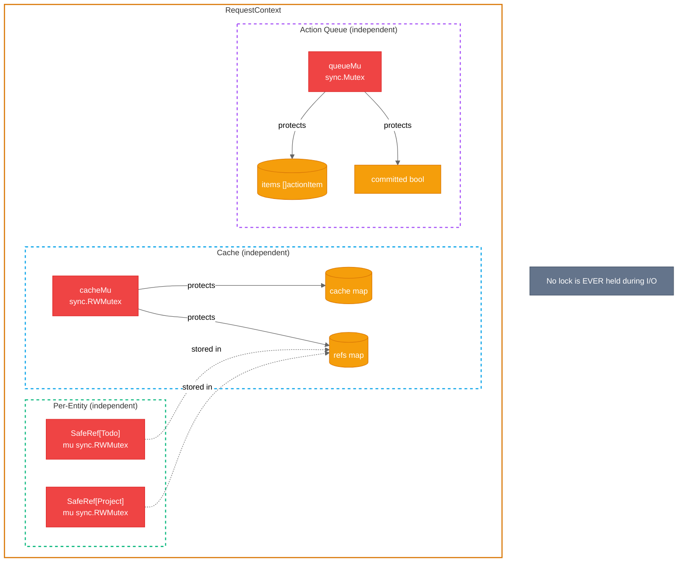
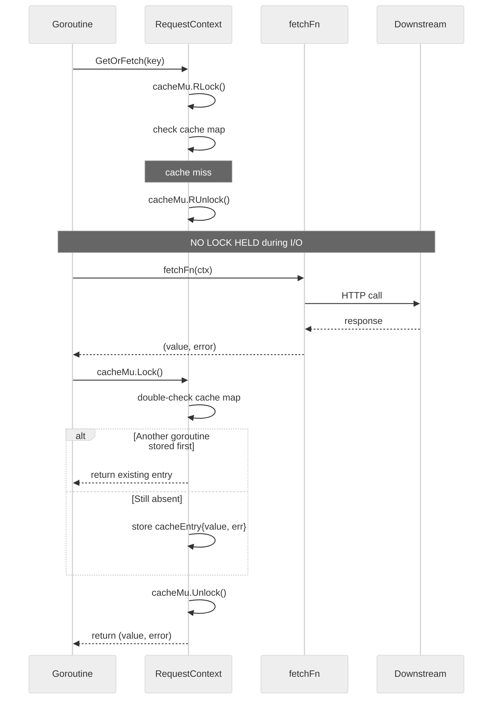
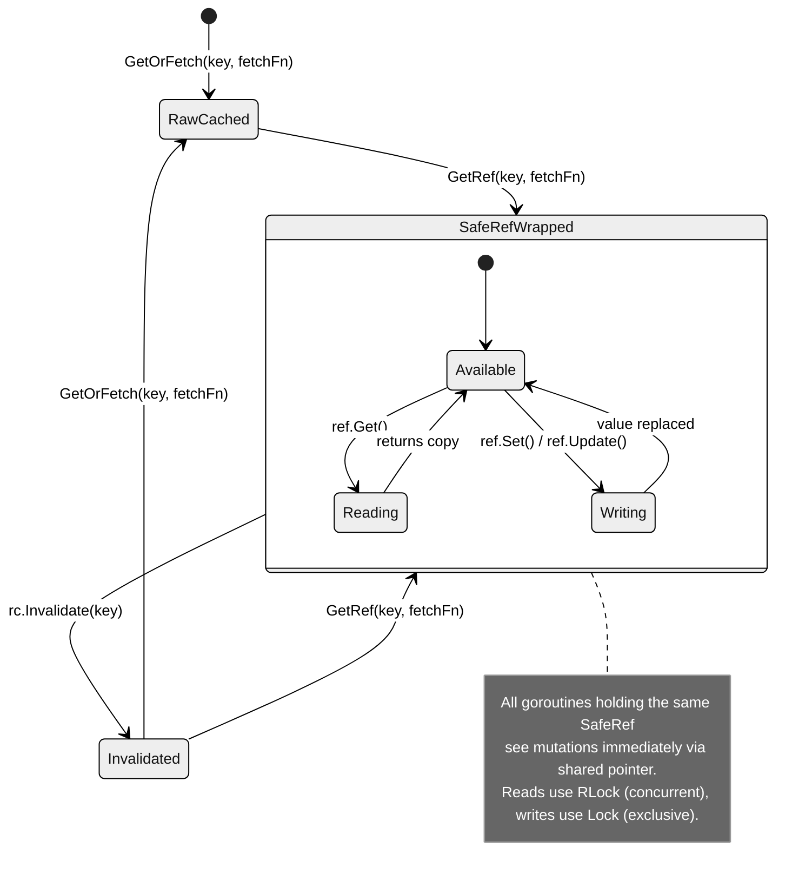
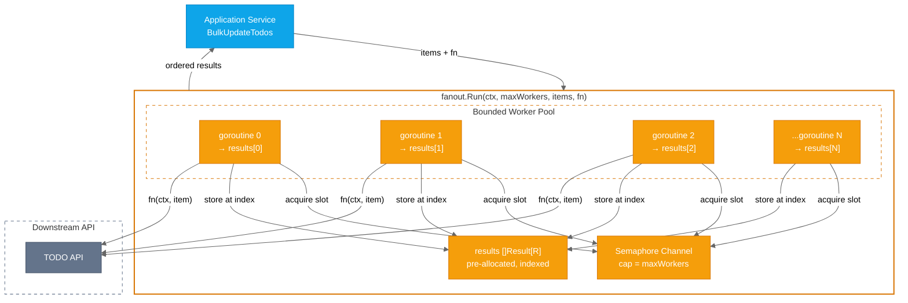

# ADR-0002: Thread-Safe Request Context and Concurrent Fan-Out

## Status

Accepted

## Context

The template supports **orchestration services** that coordinate bulk operations across
multiple downstream APIs. Bulk operations (e.g., updating 20 todos concurrently) require
goroutines that share the same `RequestContext` via Go's `context.Context`.

The original `RequestContext` was designed for sequential, single-goroutine use:

- **Cache**: Plain `map[string]cacheEntry` — not safe for concurrent access
- **Action queue**: Bare `append` to `[]actionItem` — not safe for concurrent access
- **Committed flag**: Unprotected `bool` read/write

While the initial bulk operation only used goroutines for downstream API calls (which don't
access the cache directly), the pattern is unsafe **by construction**: any future code adding
cache reads, entity mutations, or action staging from goroutines would silently introduce
data races. For a reusable template, this is unacceptable.

**Design requirements:**

1. **Centralized thread safety** — The infrastructure itself must be safe, not individual
   services. Services should never need to think about synchronization.
2. **Concurrent reads AND writes** — Goroutines must be able to read cached entities,
   mutate them, and see each other's mutations (not just read-through caching).
3. **Cache independent of commit lifecycle** — Cache operations (read, write, invalidate)
   must work before, during, and after commit. Bad code that commits early should not
   block required cache updates.
4. **Per-entity thread safety** — Thread A's mutation of TODO-1 should be immediately
   visible to Thread B reading TODO-1, without blocking Thread C working on TODO-2.
5. **Reusable across entities** — The pattern must work for any entity type, not just todos.
6. **No lock held during I/O** — Fetches and action execution must happen outside any lock.

**Alternatives considered:**

| Approach                            | Pros                                      | Cons                                               |
| ----------------------------------- | ----------------------------------------- | -------------------------------------------------- |
| Strip RC from goroutine contexts    | Simple, no sync needed                    | Goroutines can't use cache, limits capability      |
| Single global mutex on RC           | Simple implementation                     | All entities contend on one lock, poor concurrency |
| `sync.Map` for cache                | Built-in concurrent map                   | No typed access, no per-entity mutability          |
| **Per-entity SafeRef + dual mutex** | Fine-grained concurrency, typed, reusable | Small per-entity overhead (~24 bytes mutex)        |

## Decision

We make `RequestContext` thread-safe with **two independent concerns, two independent
mutexes**, plus a generic **per-entity thread-safe wrapper** (`SafeRef[T]`):

1. **`SafeRef[T]`** — Generic wrapper providing thread-safe read/write access to a single
   cached entity. Multiple goroutines holding the same `SafeRef` see each other's mutations
   immediately.

2. **Cache mutex** (`cacheMu sync.RWMutex`) — Protects the cache map and refs map.
   Independent of the action queue. Works before, during, and after commit.

3. **Queue mutex** (`queueMu sync.Mutex`) — Protects the action queue and committed flag.
   Independent of the cache.

4. **`fanout.Run[T, R]`** — Generic bounded-concurrency helper for fan-out operations.
   Zero dependencies beyond stdlib. Services use this instead of hand-rolling goroutine
   management.

## Design

### Memory Layout

```text
RequestContext (per HTTP request)
├── context.Context           (embedded, 16 bytes)
├── cacheMu sync.RWMutex     (24 bytes)
├── cache map[string]cacheEntry
│   ├── "todo:1" → cacheEntry{value: *SafeRef[Todo]}
│   ├── "todo:2" → cacheEntry{value: *SafeRef[Todo]}
│   └── "project:5" → cacheEntry{value: *Project}    ← raw value (no GetRef called)
├── refs map[string]any
│   ├── "todo:1" → *SafeRef[Todo]                    ← shared ref instances
│   └── "todo:2" → *SafeRef[Todo]
├── queueMu sync.Mutex       (8 bytes)
├── items []actionItem        (24 bytes slice header)
└── committed bool            (1 byte)

SafeRef[T] (per entity, when GetRef is used)
├── mu sync.RWMutex           (24 bytes)
└── val T                     (size of entity)
```

**Per-request overhead**: For a request caching ~10 entities, total synchronization overhead
is ~2 mutexes on RC + ~10 mutexes on SafeRefs = ~288 bytes. Negligible compared to the
entities themselves and the I/O latency of downstream calls.

### Lock Hierarchy



**Key invariant**: The three mutex groups (cache, per-entity, queue) are completely
independent. No method ever holds locks from two groups simultaneously, eliminating
deadlock risk.

### Per-Method Lock Analysis

| Method                   | Cache Lock             | Entity Lock    | Queue Lock               | I/O Under Lock?               |
| ------------------------ | ---------------------- | -------------- | ------------------------ | ----------------------------- |
| `GetOrFetch` (hit)       | `cacheMu.RLock`        | —              | —                        | No                            |
| `GetOrFetch` (miss)      | `cacheMu.Lock` (store) | —              | —                        | **No** — fetch before lock    |
| `GetRef` (hit)           | `cacheMu.RLock`        | —              | —                        | No                            |
| `GetRef` (miss)          | `cacheMu.Lock` (store) | —              | —                        | **No** — fetch before lock    |
| `SafeRef.Get`            | —                      | `ref.mu.RLock` | —                        | No                            |
| `SafeRef.Set`            | —                      | `ref.mu.Lock`  | —                        | No                            |
| `SafeRef.Update`         | —                      | `ref.mu.Lock`  | —                        | No                            |
| `Put` (existing SafeRef) | `cacheMu.Lock`         | `ref.Set()`    | —                        | No                            |
| `Put` (new key)          | `cacheMu.Lock`         | —              | —                        | No                            |
| `Invalidate`             | `cacheMu.Lock`         | —              | —                        | No                            |
| `Stage`                  | `cacheMu.Lock`         | —              | `queueMu.Lock`           | No                            |
| `AddAction`              | —                      | —              | `queueMu.Lock`           | No                            |
| `AddGroup`               | —                      | —              | `queueMu.Lock`           | No                            |
| `Commit`                 | —                      | —              | `queueMu.Lock` (briefly) | **No** — execute after unlock |

### GetOrFetch Cache Miss Path



Two goroutines missing the same key both fetch independently. The first to acquire the
write lock stores its result; the second discards its fetch and uses the stored value.
This is acceptable because:

- Fetches are idempotent reads within a short-lived request scope
- The duplicate fetch window is small (single HTTP round-trip)
- The alternative (`singleflight`) adds complexity for minimal benefit in this context

### SafeRef Lifecycle



### Concurrent Fan-Out Pattern



**Properties of `fanout.Run`:**

| Property          | Implementation                                             |
| ----------------- | ---------------------------------------------------------- |
| **Generic**       | `Run[T, R]` — any input type `T`, output type `R`          |
| **Ordered**       | Pre-allocated `[]Result[R]` indexed by input position      |
| **Bounded**       | Semaphore channel limits active goroutines to `maxWorkers` |
| **Context-aware** | Goroutines waiting for semaphore bail on `ctx.Done()`      |
| **Zero deps**     | Only `context` + `sync` from stdlib                        |

### API Summary

| Function        | Signature                                   | Thread-safe | Use when                                                   |
| --------------- | ------------------------------------------- | ----------- | ---------------------------------------------------------- |
| `GetOrFetch[T]` | `(rc, key, fetchFn) → (T, error)`           | Yes         | Simple read — get a copy of cached entity                  |
| `GetRef[T]`     | `(rc, key, fetchFn) → (*SafeRef[T], error)` | Yes         | Shared access — multiple goroutines read/write same entity |
| `Put[T]`        | `(rc, key, val)`                            | Yes         | Write-through — update cache after mutation                |
| `Invalidate`    | `(key)`                                     | Yes         | Force re-fetch on next access                              |
| `Stage`         | `(key, entity, action) → error`             | Yes         | Cache update + queue action atomically                     |
| `AddAction`     | `(action) → error`                          | Yes         | Queue single action for commit                             |
| `AddGroup`      | `(actions...) → error`                      | Yes         | Queue parallel action group for commit                     |
| `Commit`        | `(ctx) → error`                             | Yes         | Execute all queued actions                                 |
| `Execute`       | `(action) → error`                          | Yes         | Run action immediately (bypasses queue)                    |

### Cache + Queue Independence

The cache and action queue have independent lifecycles. This is a deliberate design choice:

```text
Timeline:    ──────────────────────────────────────────────►

Cache:       [  always available: GetOrFetch, GetRef, Put, Invalidate  ]

Queue:       [ open: AddAction, AddGroup, Stage ] → [ committed: no more staging ]
                                                  ↑
                                              Commit()

Key insight: Cache operations work REGARDLESS of commit state.
```

This prevents a common pitfall: if poorly ordered code calls `Commit()` early, cache reads
and writes still work. Only action staging is blocked after commit.

## Consequences

### Positive

| Benefit                    | Impact                                                                  |
| -------------------------- | ----------------------------------------------------------------------- |
| **Centralized safety**     | Services never think about synchronization — it's in the infrastructure |
| **Per-entity concurrency** | Goroutines working on different entities don't contend                  |
| **Read-your-writes**       | `Put` and `GetRef.Set` are immediately visible to all goroutines        |
| **Reusable**               | `SafeRef[T]` and `fanout.Run[T,R]` work for any entity type             |
| **No I/O under lock**      | No risk of lock starvation from slow downstream calls                   |
| **Independent lifecycles** | Cache bug doesn't break queue; queue bug doesn't break cache            |
| **Race-detector clean**    | All tests pass with `go test -race`                                     |

### Negative

| Tradeoff                                 | Mitigation                                                                                                        |
| ---------------------------------------- | ----------------------------------------------------------------------------------------------------------------- |
| **Per-entity mutex overhead**            | ~24 bytes per `SafeRef` — negligible for request-scoped caching with <100 entities                                |
| **Duplicate fetches on concurrent miss** | Acceptable for idempotent reads; window is one HTTP round-trip. Could add `singleflight` if profiling shows waste |
| **Complexity of dual-map design**        | Well-documented with clear separation; `unwrapCacheEntry` handles both raw and SafeRef entries transparently      |

### Neutral

- Existing sequential code (single-goroutine request handling) is unaffected. Uncontested
  `RWMutex` acquire/release is ~15ns — unmeasurable against downstream I/O latency.
- `SafeRef.Get()` returns a value copy, not a pointer. This is intentional: callers get a
  consistent snapshot. For in-place mutation, use `SafeRef.Update(fn)` which holds the write
  lock for the duration of the callback.

## References

- [Go Data Race Detector](https://go.dev/doc/articles/race_detector)
- [Go sync.RWMutex](https://pkg.go.dev/sync#RWMutex)
- [Double-Checked Locking in Go](https://en.wikipedia.org/wiki/Double-checked_locking)
- [ADR-0001: Hexagonal Architecture](./0001-hexagonal-architecture.md) — high-level architecture
- [ARCHITECTURE.md](../ARCHITECTURE.md) — implementation guide
