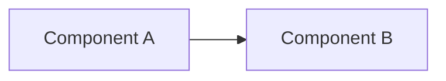

# ADR-NNNN: Title

## Status

[Proposed | Accepted | Deprecated | Superseded by ADR-XXXX]

## Context

What is the issue that we are seeing that motivates this decision or change?

## Decision

What is the change that we are proposing and/or doing?

## Design

Visual representation of the architecture or design being proposed.

### Overview Diagram

### Detailed Diagrams

Add additional diagrams as needed (sequence diagrams, state machines, etc.)

## Consequences

What becomes easier or more difficult to do because of this change?

### Positive

- Benefit 1
- Benefit 2

### Negative

- Tradeoff 1
- Tradeoff 2

### Neutral

- Observation 1

## References

- [Link to relevant documentation]
